# Java Collections Framework: Ultimate Interview Prep Guide

> A comprehensive, deep-dive reference for mastering Java Collections in technical interviews. Built for senior engineers, system design discussions, and architecture-level decision-making.

---

## Table of Contents

1. [Collections Hierarchy](#collections-hierarchy)
2. [Core Interfaces & Contracts](#core-interfaces--contracts)
3. [List Implementations](#list-implementations)
4. [Set Implementations](#set-implementations)
5. [Map Implementations](#map-implementations)
6. [Queue & Deque Implementations](#queue--deque-implementations)
7. [Performance & Complexity Analysis](#performance--complexity-analysis)
8. [Advanced Topics](#advanced-topics)
9. [Classic Interview Questions](#classic-interview-questions)
10. [Best Practices & Patterns](#best-practices--patterns)

---

## Collections Hierarchy

### Complete Inheritance Tree

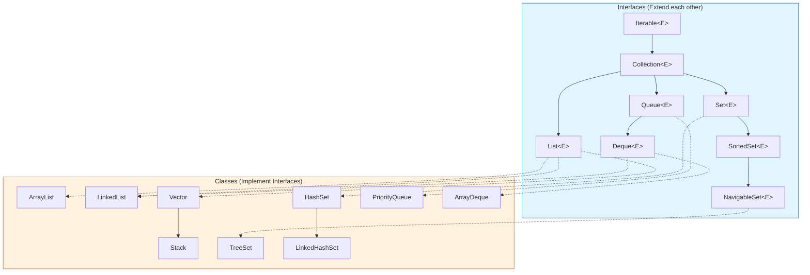

### Conceptual Relationships

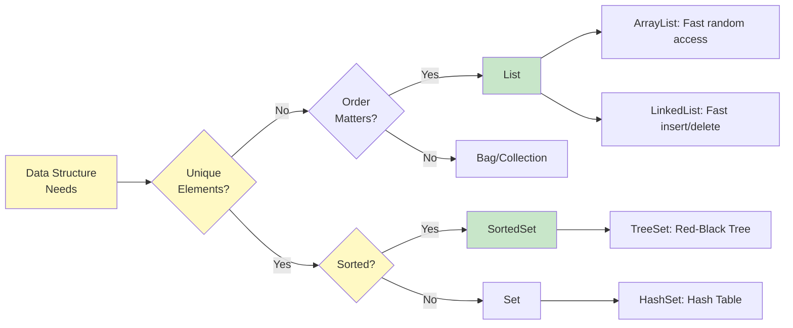

---

## Core Interfaces & Contracts

### Collection Interface Hierarchy

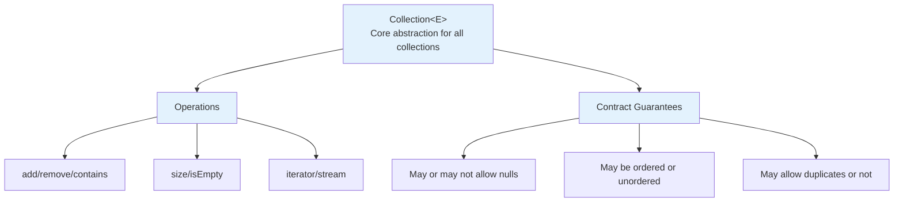

### Key Interface Contracts

| Interface | Ordering | Duplicates | Null | Access | Use Case |
|-----------|----------|-----------|------|--------|----------|
| **List** | Insertion | ✓ | ✓ | By index | Sequences, positional access |
| **Set** | None | ✗ | 1 null | By object | Uniqueness guarantee |
| **SortedSet** | Natural order | ✗ | None | Range view | Sorted, no duplicates |
| **NavigableSet** | Natural order | ✗ | None | Range + nav | Sorted + range operations |
| **Queue** | FIFO/Priority | ✓ | Varies | Head/Tail | Task scheduling, message passing |
| **Deque** | Both ends | ✓ | Varies | Both ends | Double-ended queuing |
| **Map** | None | Key unique | 1 null key | By key | Key-value associations |
| **SortedMap** | Key order | Key unique | No null key | Range view | Sorted associations |

---

## List Implementations

### ArrayList vs LinkedList: Deep Dive

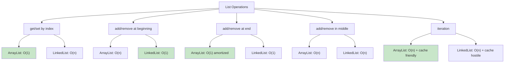

### ArrayList Internal Structure

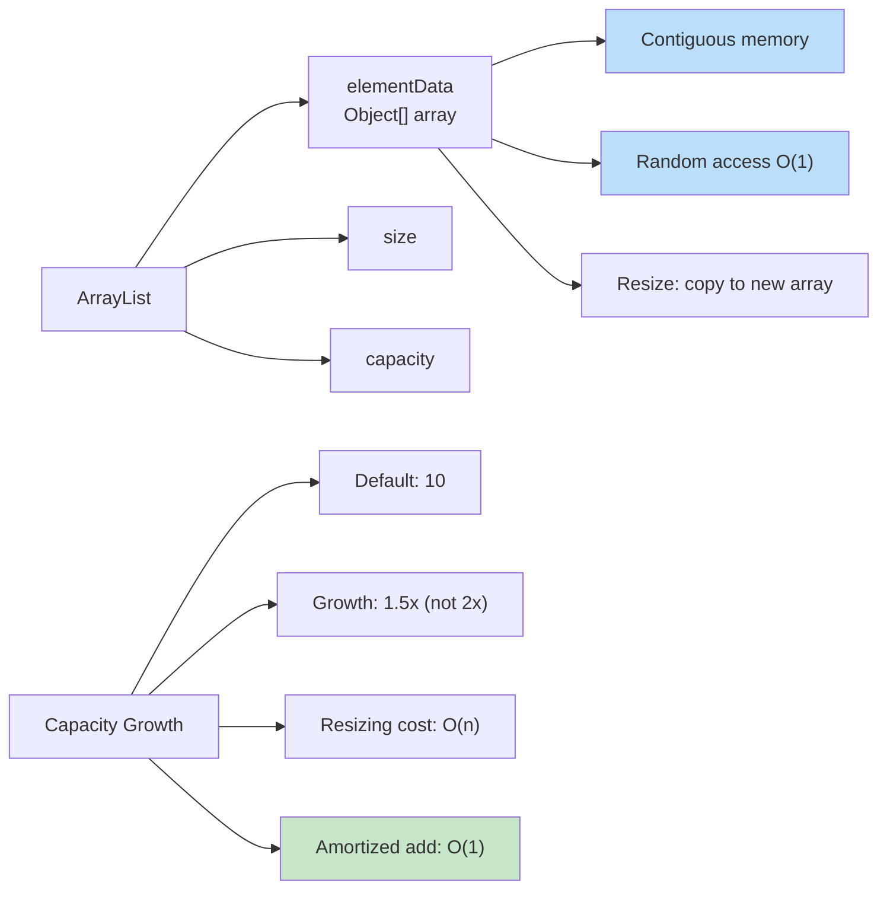

### LinkedList Internal Structure

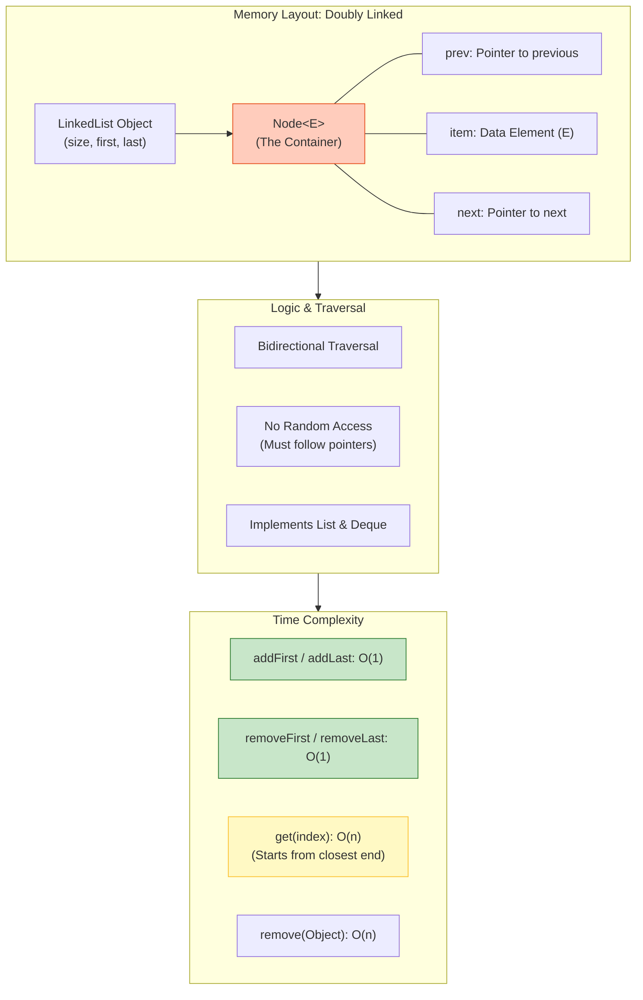

### Choosing Between ArrayList and LinkedList

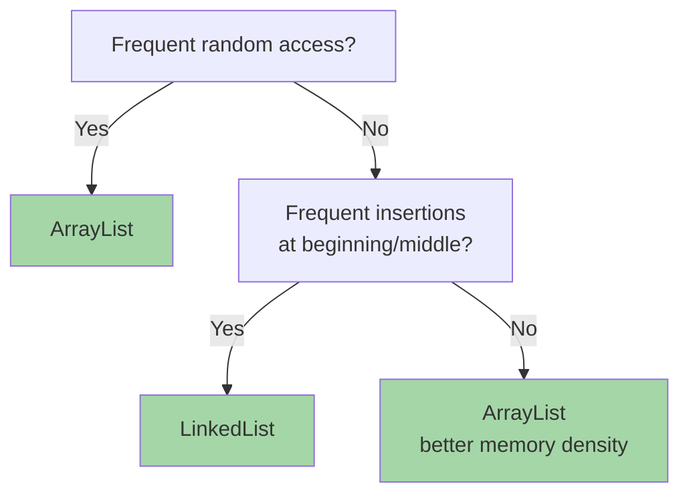

---

## Set Implementations

### HashSet: Hash Table Internals

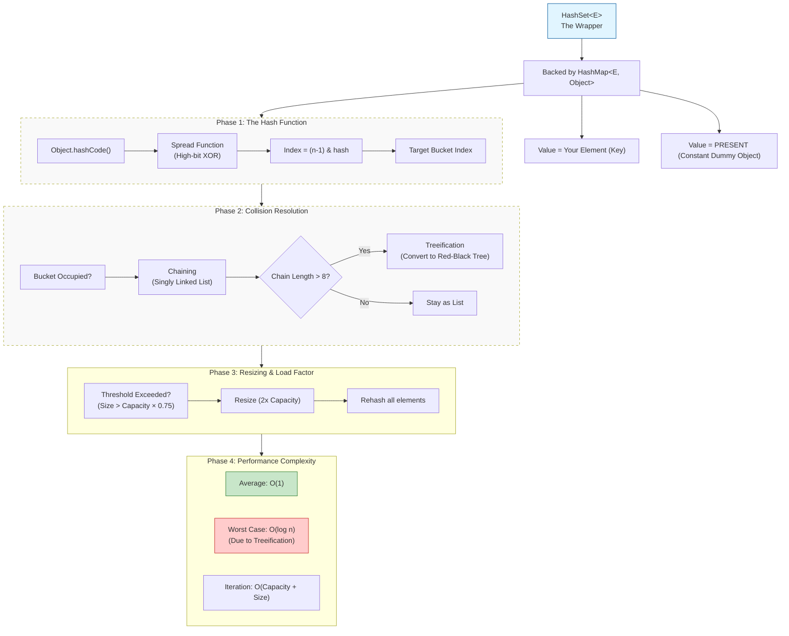

### TreeSet: Red-Black Tree Implementation

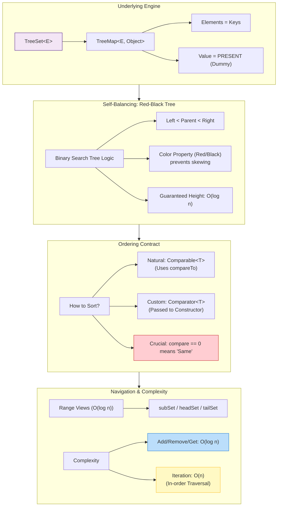

### LinkedHashSet: Insertion Order Preservation

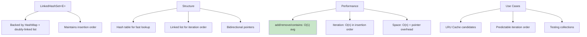

### Set Comparison Matrix

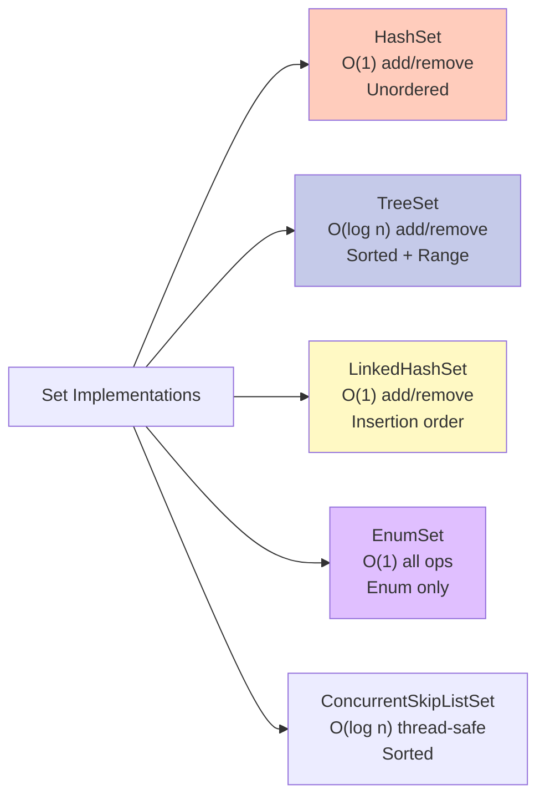

---

## Map Implementations

### HashMap: Anatomy of Hash Table

```mermaid
graph TD
    A["HashMap&lt;K,V&gt;"] --> B["Internal Array (bucket[])"]
    B --> B1["Index = hash(key) % capacity"]
    B --> B2["Each bucket holds Entry chain"]
    
    C["Entry Node"] --> C1["key: K"]
    C --> C2["value: V"]
    C --> C3["hash: int"]
    C --> C4["next: Entry (for chaining)"]
    
    D["Hash Collision"] --> D1["Multiple keys same hash"]
    D --> D2["JDK 6-7: Linked list chain"]
    D --> D3["JDK 8+: Linked list → Red-Black Tree"]
    D --> D4["Conversion at chain length = 8"]
    D --> D5["Back to list at length = 6"]
    
    E["Resizing"] --> E1["Load Factor = size / capacity"]
    E --> E2["Default: 0.75"]
    E --> E3["Resize trigger: size > 0.75 × capacity"]
    E --> E4["New capacity: 2x old"]
    E --> E5["All entries rehashed"]
    
    F["Performance"] --> F1["get/put/remove: O(1) avg"]
    F --> F2["O(log n) worst case (JDK 8+)"]
    F --> F3["Iteration: O(n + capacity)"]
    
    style F1 fill:#c8e6c9
    style F2 fill:#ffccbc
```

### TreeMap: Sorted Map with Red-Black Tree

```mermaid
graph TD
    A["TreeMap&lt;K,V&gt;"] --> B["Red-Black Tree"]
    B --> B1["Keys stored in sorted order"]
    B --> B2["Ordered by Comparator or key natural order"]
    
    C["Structure"] --> C1["Left < root < right"]
    C --> C2["Self-balancing via rotations"]
    C --> C3["Height always O(log n)"]
    
    D["Performance"] --> D1["get/put/remove: O(log n)"]
    D --> D2["Iteration: O(n) in sorted order"]
    D --> D3["firstEntry/lastEntry: O(log n)"]
    
    E["Range Views"] --> E1["subMap(from, to): O(log n) access"]
    E --> E2["headMap(to)"]
    E --> E3["tailMap(from)"]
    E --> E4["Lazy views: backed by tree"]
    
    F["Use Cases"] --> F1["Sorted data"]
    F --> F2["Range queries"]
    F --> F3["Sorted iteration needed"]
    F --> F4["Lexicographic ordering"]
    
    style D1 fill:#bbdefb
    style D2 fill:#c8e6c9
```

### LinkedHashMap: Insertion + Access Order

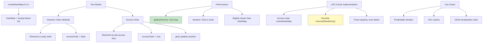

### ConcurrentHashMap: Thread-Safe Hash Map

```mermaid
graph TD
    A["ConcurrentHashMap&lt;K,V&gt;"] --> B["Bucket-level locking"]
    B --> B1["Not synchronized!"]
    B --> B2["Multiple threads: different buckets"]
    B --> B3["Better concurrency than synchronized"]
    
    C["Internals (JDK 8+)"] --> C1["Segment-based locking abandoned"]
    C --> C2["Node-based with CAS operations"]
    C --> C3["Compare-And-Swap for atomic updates"]
    
    D["Performance"] --> D1["get: O(1) no locks"]
    D --> D2["put/remove: O(1) with bucket lock"]
    D --> D3["High concurrency under load"]
    
    E["Contract"] --> E1["Weakly consistent iterator"]
    E --> E2["Reflects concurrent modifications"]
    E --> E3["No fail-fast guarantee"]
    E --> E4["Safe for long iteration"]
    
    F["vs Collections.synchronizedMap()"] --> F1["ConcurrentHashMap: better"]
    F --> F2["Segment/bucket locking"]
    F --> F3["Collections.synchronized: whole lock"]
    F --> F4["No concurrent reads"]
    
    style D3 fill:#c8e6c9
```

### Map Implementation Decision Tree

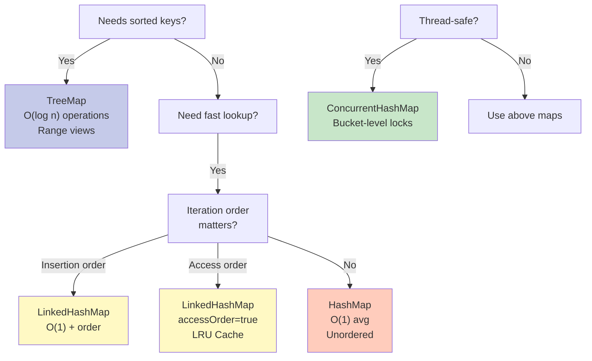

### Special Maps

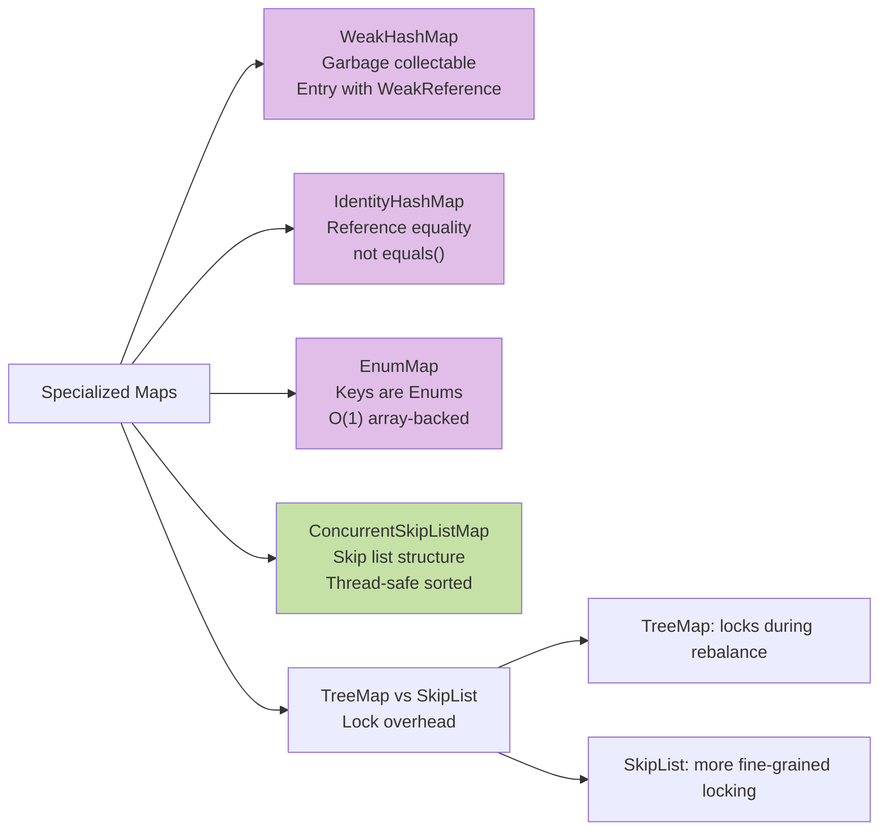

---

## Queue & Deque Implementations

### Queue Hierarchy & Types

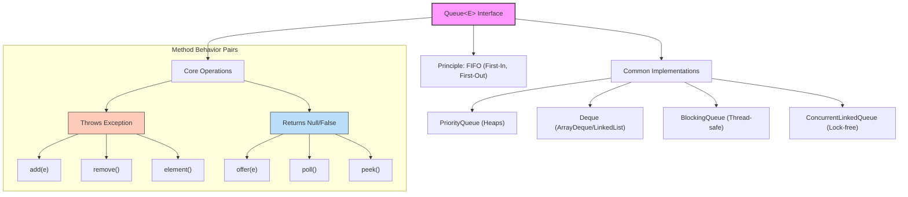

### PriorityQueue: Min-Heap Implementation
```mermaid
graph TD
    %% Main Identity
    PQ["PriorityQueue&lt;E&gt; Deep Dive"]
    
    %% Internal Storage Mechanism
    PQ --> Storage["Physical Storage: Dynamic Array"]
    subgraph ArrayMapping ["Array-to-Tree Mapping"]
        direction TB
        A0["Index 0: The Root (Minimum)"]
        A1["Index i's Left Child: 2i + 1"]
        A2["Index i's Right Child: 2i + 2"]
        A3["Index i's Parent: (i - 1) / 2"]
    end
    Storage --> ArrayMapping

    %% Behavioral Logic: Sift Up
    PQ --> SiftUp["Operation: offer(E e)"]
    subgraph SiftUpLogic ["Sift-Up (Heapify Up)"]
        direction TB
        U1["1. Add element to the end of array"]
        U2["2. Compare with Parent"]
        U3["3. If Child &lt; Parent: Swap"]
        U4["4. Repeat until Root or Parent &lt; Child"]
    end
    SiftUp --> SiftUpLogic

    %% Behavioral Logic: Sift Down
    PQ --> SiftDown["Operation: poll()"]
    subgraph SiftDownLogic ["Sift-Down (Heapify Down)"]
        direction TB
        D1["1. Remove Root (Index 0)"]
        D2["2. Move last array element to Root"]
        D3["3. Compare Root with Smallest Child"]
        D4["4. If Root &gt; Child: Swap"]
        D5["5. Repeat until Leaf or Root &lt; Children"]
    end
    SiftDown --> SiftDownLogic

    %% Key Performance Trade-offs
    PQ --> Specs["Technical Constraints"]
    subgraph Constraints ["Critical Rules"]
        direction TB
        R1["No Null Elements (throws NPE)"]
        R2["Not Thread-Safe (use PriorityBlockingQueue)"]
        R3["Iterator: No guaranteed order"]
        R4["Resize: Grow by 50% to 100%"]
    end
    Specs --> Constraints

    %% Styling
    style PQ fill:#f9f,stroke:#333,stroke-width:2px
    style S1 fill:#fff9c4
    style SiftUp fill:#c8e6c9
    style SiftDown fill:#ffccbc
```

🧠 Deep Dive: The "Bubble" Mechanics
Since you mentioned "Bubble Up" and "Bubble Down" (also known as Sift-Up and Sift-Down), here is why they happen:

Bubble Up (Add): When you add an element, it goes to the very end of the array (the bottom-right of the tree). To maintain the heap property, it "swaps" with its parent until it finds its rightful place.

Bubble Down (Poll): When you remove the root, the last element in the array is moved to the root position. It then "sinks" down by swapping with its smallest child until the tree is balanced again.

⚠️ A Common Gotcha: Iteration Order
One thing that trips people up: if you print a PriorityQueue directly or use an Iterator, it will not appear sorted. * The array structure only guarantees that the root is the minimum.

To get elements in sorted order, you must use poll() until the queue is empty.

Since `PriorityQueue` is a **Min-Heap** by default, reversing it into a **Max-Heap** is a common task in coding interviews (like the "Kth Largest Element" problem).

Here is the breakdown of how to implement both, along with the logic shift that happens under the hood.

---

#### 📉 1. Min-Heap (Default)
In a Min-Heap, the smallest element stays at the root. Java uses the **Natural Order** of the elements (e.g., $1 < 2 < 3$).

```java
// Default constructor creates a Min-Heap
PriorityQueue<Integer> minHeap = new PriorityQueue<>();

minHeap.addAll(Arrays.asList(10, 5, 20));

System.out.println(minHeap.poll()); // Outputs: 5
System.out.println(minHeap.poll()); // Outputs: 10
```


---

#### 📈 2. Max-Heap (Reversed)
To flip the logic so the largest element stays at the root, you provide a custom `Comparator`. There are two clean ways to do this:

**Option A: Using Collections Utility**
```java
PriorityQueue<Integer> maxHeap = new PriorityQueue<>(Collections.reverseOrder());
```

**Option B: Using a Lambda (Manual Logic)**
```java
// (a, b) -> b - a  swaps the comparison logic
PriorityQueue<Integer> maxHeap = new PriorityQueue<>((a, b) -> b - a);

maxHeap.addAll(Arrays.asList(10, 5, 20));

System.out.println(maxHeap.poll()); // Outputs: 20
System.out.println(maxHeap.poll()); // Outputs: 10
```

---

#### ⚖️ Summary Comparison

| Feature | Min-Heap (Default) | Max-Heap (Custom) |
| :--- | :--- | :--- |
| **Root Element** | Smallest | Largest |
| **Logic** | $a < b$ | $a > b$ |
| **Comparator** | `null` (Natural) | `Collections.reverseOrder()` |
| **Common Use** | Finding the "Top K Smallest" | Finding the "Top K Largest" |


#### 💡 Pro-Tip: The "Kth" Strategy
* If you want the **Kth Largest** element, use a **Min-Heap** of size $K$. As you add elements, peek/poll the smallest ones out. What remains at the root is the $Kth$ largest.
* If you want the **Kth Smallest**, use a **Max-Heap** of size $K$.

### Deque: Double-Ended Queue

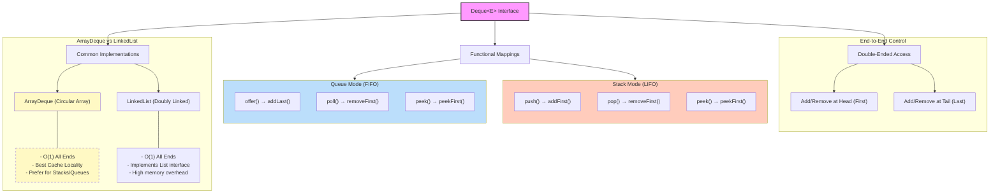


### ArrayDeque: Circular Array

```mermaid
graph LR
    A["ArrayDeque&lt;E&gt;"] --> B["Circular array buffer"]
    B --> B1["head pointer"]
    B --> B2["tail pointer"]
    B --> B3["Wrap-around using modulo"]
    
    C["Example"] --> C1["Capacity: 8"]
    C --> C2["head=5, tail=2"]
    C --> C3["Elements: [_, _, E1, E2, E3, E4, E5, E6]"]
    C --> C4["Logical order: E4-E5-E6-E1-E2-E3"]
    
    D["Performance"] --> D1["addFirst/addLast: O(1)"]
    D --> D2["removeFirst/removeLast: O(1)"]
    D --> D3["Resizing: O(n)"]
    
    E["Memory"] --> E1["Contiguous array"]
    E --> E2["Better cache locality than LinkedList"]
    E --> E3["No pointer overhead"]
    
    style D1 fill:#c8e6c9
    style D2 fill:#c8e6c9
```

---

## Performance & Complexity Analysis

### Time Complexity Comparison

```mermaid
graph LR
    A["Operation Complexities"] --> B["List"]
    A --> C["Set"]
    A --> D["Map"]
    A --> E["Queue"]
    
    B --> B1["ArrayList"]
    B1 --> B1a["get: O(1)"]
    B1 --> B1b["add/remove: O(n)"]
    B1 --> B1c["add at end: O(1)"]
    
    B --> B2["LinkedList"]
    B2 --> B2a["get: O(n)"]
    B2 --> B2b["add/remove first: O(1)"]
    B2 --> B2c["add/remove middle: O(n)"]
    
    C --> C1["HashSet"]
    C1 --> C1a["add/remove/contains: O(1)"]
    
    C --> C2["TreeSet"]
    C2 --> C2a["add/remove/contains: O(log n)"]
    
    D --> D1["HashMap"]
    D1 --> D1a["get/put/remove: O(1)"]
    
    D --> D2["TreeMap"]
    D2 --> D2a["get/put/remove: O(log n)"]
    
    E --> E1["PriorityQueue"]
    E1 --> E1a["add: O(log n)"]
    E1 --> E1b["remove: O(log n)"]
    
    style B1a fill:#c8e6c9
    style B2c fill:#ffccbc
    style C1a fill:#c8e6c9
    style C2a fill:#bbdefb
```

### Memory Usage Patterns

| Collection | Space | Overhead | Notes |
|-----------|-------|----------|-------|
| **ArrayList** | O(n) | Low | ~12.5% over capacity |
| **LinkedList** | O(n) | 2 pointers/node | ~200% overhead vs data |
| **HashSet** | O(n) | Load factor | Bucket array + entries |
| **TreeSet** | O(n) | Moderate | Node pointers + colors |
| **HashMap** | O(n) | ~0.75n capacity | Bucket array sizing |
| **TreeMap** | O(n) | Moderate | Node pointers + colors |
| **LinkedHashMap** | O(n) | ~1.5x HashMap | Doubly-linked overhead |
| **ConcurrentHashMap** | O(n) | Segments | More than HashMap |

### Iteration Performance

```mermaid
graph TD
    A["Iteration Strategy"] --> B["ArrayList"]
    B --> B1["for(int i=0; i < list.size(); i++)"]
    B1 --> B1a["Fastest: Direct index access"]
    
    B --> B2["Enhanced for or Iterator"]
    B --> B2a["Still O(n) but with object overhead"]
    
    C["LinkedList"] --> C1["Enhanced for or Iterator"]
    C --> C1a["Fastest: Uses internal pointers"]
    
    C --> C2["for(int i=0; i < list.size(); i++)"]
    C2 --> C2a["AVOID: O(n²) - traverses from start every time!"]
    
    D["HashMap / HashSet"] --> D1["Iterator or Enhanced for"]
    D --> D1a["Only way: O(n + capacity)"]
    
    E["TreeSet / TreeMap"] --> E1["Iterator: O(n) in sorted order"]
    E --> E1a["In-order traversal"]
    
    style B1 fill:#c8e6c9,stroke:#2e7d32
    style C2a fill:#ff9999,stroke:#c62828
    style D1a fill:#c8e6c9,stroke:#2e7d32
```
Note:
### ⚠️ Performance Warning: The $O(n^2)$ Trap

When iterating over a `LinkedList`, the **choice of loop** drastically impacts performance. Using a standard `for` loop with `list.get(i)` is a common anti-pattern that leads to quadratic time complexity.


#### ❌ The Anti-Pattern ($O(n^2)$)
```java
// Total Complexity: O(n^2)
for (int i = 0; i < list.size(); i++) {
    System.out.println(list.get(i)); 
}
```
**Why it's slow:** `LinkedList` does not support random access. Every time `list.get(i)` is called, the JVM must start from the `head` (or `tail`) and step through $i$ nodes. For a list of size $n$, the total operations are $1 + 2 + 3 + ... + n$, resulting in **$O(n^2)$**.

#### ✅ The Best Practice ($O(n)$)
```java
// Total Complexity: O(n)
for (String item : list) {
    System.out.println(item);
}
// OR
list.forEach(System.out::println);
```
**Why it's fast:** The enhanced `for-each` loop (and `Iterator`) keeps a pointer to the **current node**. Moving to the next element is a simple $O(1)$ operation (following the `next` pointer), resulting in a linear **$O(n)$** total traversal.

---

### Iteration Strategy Comparison


```mermaid
graph TD
    A["Iteration Strategy"] --> B["ArrayList"]
    B --> B1["for(int i=0; i < list.size(); i++)"]
    B --> B1a["Fastest: Direct index access"]
    
    B --> B2["Enhanced for or Iterator"]
    B --> B2a["Still O(n) but with object overhead"]
    
    C["LinkedList"] --> C1["Enhanced for or Iterator"]
    C --> C1a["Fastest: Uses internal pointers"]
    
    C --> C2["for(int i=0; i < list.size(); i++)"]
    C2 --> C2a["AVOID: O(n²) - traverses from start every time!"]
    
    D["HashMap / HashSet"] --> D1["Iterator or Enhanced for"]
    D --> D1a["Only way: O(n + capacity)"]
    
    E["TreeSet / TreeMap"] --> E1["Iterator: O(n) in sorted order"]
    E --> E1a["In-order traversal"]
    
    style B1 fill:#c8e6c9,stroke:#2e7d32
    style C2a fill:#ff9999,stroke:#c62828
    style D1a fill:#c8e6c9,stroke:#2e7d32
```


---

## Advanced Topics

### Fail-Fast Iterator

```mermaid
graph TD
    A["Fail-Fast Behavior"] --> B["What is it?"]
    B --> B1["Iterator detects concurrent modification"]
    B --> B2["Throws ConcurrentModificationException"]
    
    C["How it works"] --> C1["modCount field in collection"]
    C --> C2["Iterator records modCount at creation"]
    C --> C3["Each operation checks: current == recorded"]
    C --> C4["Mismatch triggers fail-fast"]
    
    D["Modification Types"] --> D1["add/remove via collection (not iterator)"]
    D --> D2["Iterator.remove() is safe"]
    D --> D3["Multiple threads"]
    
    E["Gotcha"] --> E1["Fail-fast is best-effort, not guaranteed"]
    E --> E2["May not catch all concurrent mods"]
    E --> E3["Don't rely on exception for synchronization"]
    
    F["Workarounds"] --> F1["CopyOnWriteArrayList (thread-safe)"]
    F --> F2["Collections.synchronizedList()"]
    F --> F3["Lock collection during iteration"]
    F --> F4["Use concurrent collections"]
    
    style B2 fill:#ffcccc
    style E1 fill:#fff9c4
    style F1 fill:#c8e6c9
```

### Null Handling Across Collections

```mermaid
graph TD
    A["Null in Collections"] --> B["HashMap/LinkedHashMap"]
    B --> B1["One null key allowed"]
    B --> B2["Multiple null values allowed"]
    
    C["HashSet/LinkedHashSet"] --> C1["One null allowed"]
    
    D["TreeMap/TreeSet"] --> D1["No nulls allowed"]
    D --> D2["Comparator.compare(null, x)"]
    D --> D3["Throws NullPointerException"]
    
    E["ArrayList/LinkedList"] --> E1["Nulls allowed"]
    E --> E2["contains(null) works"]
    
    F["ConcurrentHashMap"] --> F1["No null keys or values"]
    F --> F2["Design: distinguish key/value absence"]
    
    G["PriorityQueue"] --> G1["No nulls allowed"]
    G --> G2["Heap invariant needs comparisons"]
    
    H["Interview Tip"] --> H1["Always document null handling"]
    H --> H2["Provide null check if needed"]
    H --> H3["Consider NPE in comparisons"]
    
    style D1 fill:#ffcccc
    style F1 fill:#ffcccc
    style G1 fill:#ffcccc
```

### Thread Safety & Concurrency

```mermaid
graph TD
    A["Thread Safety Options"] --> B["Non-thread-safe"]
    B --> B1["ArrayList, HashMap, etc"]
    B --> B2["Use external synchronization"]
    
    C["Synchronized Wrapper"] --> C1["Collections.synchronizedList()"]
    C --> C2["Whole collection locked"]
    C --> C3["All threads wait"]
    C --> C4["Simple but low throughput"]
    
    D["Concurrent Collections"] --> D1["ConcurrentHashMap"]
    D --> D2["CopyOnWriteArrayList"]
    D --> D3["ConcurrentLinkedQueue"]
    D --> D4["Bucket/segment locking"]
    D --> D5["Higher throughput"]
    
    E["BlockingQueue"] --> E1["For producer-consumer"]
    E --> E2["put/take block on empty/full"]
    E --> E3["ArrayBlockingQueue"]
    E --> E4["LinkedBlockingQueue"]
    
    F["Performance"] --> F1["No concurrency needs: ArrayList"]
    F --> F2["Low contention: Concurrent*"]
    F --> F3["High contention: Concurrent > Synchronized"]
    
    style D5 fill:#c8e6c9
    style F3 fill:#c8e6c9
```

### Ordering Strategies: Comparable vs. Comparator

In Java, sorting and ordering are governed by two distinct interfaces. Choosing the right one depends on whether you want a **default** behavior or **flexible, multiple** behaviors.

---

#### 1. Comparable: Natural Ordering
* **Definition:** The class itself defines its own default sorting logic by implementing the interface.
* **Method:** `public int compareTo(T other)`
* **Usage:** Best for "Natural" order (e.g., Dates by time, Strings alphabetically).
* **Constraint:** You can only have **one** implementation per class.

**Sample Logic:**
```java
public class Student implements Comparable<Student> {
    private int id;
    private String name;

    // Natural order: sort by ID ascending
    @Override
    public int compareTo(Student other) {
        // Returns negative if this < other, 0 if equal, positive if this > other
        return this.id - other.id; 
    }
}
```

#### 2. Comparator: Custom Ordering
* **Definition:** An external "judge" that compares two objects.
* **Method:** `public int compare(T o1, T o2)`
* **Usage:** Used for **multiple** sorting strategies or when you cannot modify the target class.

**Sample Logic (Modern Java 8+ Lambda):**
```java
// Concise lambda expression
Comparator<Student> nameComparator = (s1, s2) -> s1.getName().compareTo(s2.getName());

// Usage
Collections.sort(studentList, nameComparator);
```

**Sample Logic (Old Java 7/8 Anonymous Class):**
```java
// The "Old Way" before Lambdas were common
Comparator<Student> ageComparator = new Comparator<Student>() {
    @Override
    public int compare(Student s1, Student s2) {
        return s1.getAge() - s2.getAge();
    }
};

// Usage
Collections.sort(studentList, ageComparator);
```

---

#### Architecture Overview


```mermaid
graph TD
    A["Ordering Strategies"]
    A --> B["Comparable"]
    A --> C["Comparator"]
    
    subgraph Comparable_Details [Comparable: Internal]
        B --> B1["Implemented by the class itself"]
        B1 --> B2["Method: compareTo(T other)"]
        B2 --> B3["Defines 'Natural' ordering"]
        B3 --> B4["Only ONE implementation possible"]
    end
    
    subgraph Comparator_Details [Comparator: External]
        C --> C1["Separate class or Lambda"]
        C1 --> C2["Method: compare(T o1, T o2)"]
        C2 --> C3["Defines 'Custom' ordering"]
        C3 --> C4["MULTIPLE implementations possible"]
    end
    
    Comparable_Details --> D["Examples"]
    Comparator_Details --> D
    
    subgraph Practical_Use [Practical Application]
        D --> D1["Integer/String implement Comparable"]
        D1 --> D2["TreeSet/TreeMap use these for sorting"]
        D2 --> D3["Collections.sort() accepts Comparator"]
    end
    
    Practical_Use --> E["Critical: Consistency"]
    
    subgraph Consistency_Rule [The Equality Contract]
        E --> E1["compare/compareTo should be consistent with equals()"]
        E1 --> E2["If compare == 0, then equals should be true"]
        E2 --> E3["Inconsistency breaks TreeSet/TreeMap logic"]
    end

    style B3 fill:#bbdefb,stroke:#1976d2
    style C3 fill:#bbdefb,stroke:#1976d2
    style E3 fill:#ffcdd2,stroke:#c62828
```

---

#### ⚠️ Critical Note: Consistency with `equals()`
For sorted collections like `TreeSet` or `TreeMap`, it is vital that your sorting logic is **consistent with equals**. 
* **The Rule:** If `a.equals(b)` is `true`, then `compare(a, b)` **must** return `0`.
* **The Risk:** If the comparator returns `0` for two objects that are not actually "equal" via `.equals()`, `TreeSet` will treat them as duplicates and refuse to add the second one.


### Capacity vs Size

```mermaid
graph TD
    A["ArrayList Internals"] --> B["size: actual elements"]
    A --> C["capacity: underlying array length"]
    A --> D["size <= capacity always"]
    
    E["Resizing Behavior"] --> E1["add() beyond capacity"]
    E --> E2["New capacity = old × 1.5 (rounded down)"]
    E --> E3["Copy array O(n)"]
    E --> E4["Amortized: O(1) per add"]
    
    F["Optimization"] --> F1["Use ArrayList(initialCapacity)"]
    F --> F2["If size known, set capacity upfront"]
    F --> F3["Avoids resizing cost"]
    F --> F4["Pre-allocate for bulk data"]
    
    G["Example"] --> G1["ArrayList<String> list = new ArrayList<>(1000)"]
    G --> G2["Creating 1000 items: no resize"]
    G --> G3["vs new ArrayList(): 10 resizes"]
    
    H["trimToSize()"] --> H1["Shrinks capacity to size"]
    H --> H2["Use after many removals"]
    H --> H3["Tradeoff: memory vs speed"]
    
    style E4 fill:#c8e6c9
    style F2 fill:#fff9c4
```

---

## Classic Interview Questions

### Q1: HashMap vs TreeMap vs LinkedHashMap

**Answer Structure:**

| Aspect | HashMap | TreeMap | LinkedHashMap |
|--------|---------|---------|---------------|
| **Ordering** | No | Sorted keys | Insertion order |
| **Time Complexity** | O(1) | O(log n) | O(1) |
| **Use Case** | Fast lookup | Range queries, sorted | Predictable iteration |
| **Null Keys** | 1 allowed | None | 1 allowed |
| **Thread-Safe** | No | No | No |
| **Example** | Caches | Leaderboards | JSON order |

**Code Example:**
```java
// HashMap: unordered, fastest
Map<String, Integer> map = new HashMap<>();
map.put("C", 3);
map.put("A", 1);
map.put("B", 2);
// Iteration order: undefined (likely A, B, C but not guaranteed)

// TreeMap: sorted by key
Map<String, Integer> sorted = new TreeMap<>();
sorted.put("C", 3);
sorted.put("A", 1);
sorted.put("B", 2);
// Iteration: A, B, C (always)

// LinkedHashMap: insertion order
Map<String, Integer> ordered = new LinkedHashMap<>();
ordered.put("C", 3);
ordered.put("A", 1);
ordered.put("B", 2);
// Iteration: C, A, B (insertion order preserved)
```

---

### Q2: ArrayList vs LinkedList - When to Use Each?

**ArrayList:**
- ✅ Frequent random access by index
- ✅ Mostly append operations
- ✅ Memory efficiency matters
- ✅ Iteration performance critical
- ❌ Frequent inserts at beginning
- ❌ Frequent middle removals

**LinkedList:**
- ✅ Frequent inserts/removes at ends
- ✅ Frequent middle insertions/removals
- ✅ Used as Queue/Deque
- ❌ Random access needed
- ❌ Memory constrained
- ❌ Cache-friendly iteration required

**Code Example:**
```java
// ArrayList: O(1) get, O(n) insert at start
List<Integer> list = new ArrayList<>();
list.add(1);      // O(1) amortized
list.get(500);    // O(1) fast

// LinkedList: O(1) operations at ends
LinkedList<Integer> deque = new LinkedList<>();
deque.addFirst(1);      // O(1)
deque.removeFirst();    // O(1)
deque.add(2);           // O(1)
// BUT: deque.get(500) is O(n)!
```

---

### Q3: Why Does HashMap Use Power of 2 Capacity?

**Answer:**

HashMap always maintains capacity as power of 2 (16, 32, 64, ...). This enables:

```
Index = hash(key) & (capacity - 1)
// Instead of: Index = hash(key) % capacity

Examples:
- hash = 35, capacity = 16 (binary: 10000)
- 35 & 15 (binary: 01111) = 00011 = 3
// Much faster: bitwise AND vs modulo division
```

**Benefits:**
1. **Speed**: Bitwise AND faster than modulo
2. **Distribution**: Spreads hash values evenly (if hash function good)
3. **Resizing**: New capacity 2x, rehashing simple

**Interview Follow-up:** "What if you don't use power of 2?"
- Modulo slower but works
- Hash distribution might be worse
- LinkedHashMap also uses this for consistency

---

### Q4: ConcurrentHashMap vs Collections.synchronizedMap()

**Collections.synchronizedMap():**
```java
Map<String, Integer> map = Collections.synchronizedMap(new HashMap<>());
// Entire map locked during any operation
// Thread A: put() → entire lock
// Thread B: get() → waits for Thread A
// Result: Serial execution, low throughput
```

**ConcurrentHashMap:**
```java
Map<String, Integer> map = new ConcurrentHashMap<>();
// Bucket-level locking (JDK 8+: node-level)
// Thread A: put() on bucket 1 → lock bucket 1
// Thread B: get() on bucket 5 → can proceed immediately
// Result: Parallel execution, high throughput
```

**Comparison:**

| Aspect | synchronizedMap | ConcurrentHashMap |
|--------|-----------------|-------------------|
| **Lock Level** | Whole map | Bucket/node |
| **Concurrency** | Serial | Parallel |
| **get() thread-safe** | Yes | Yes (no lock!) |
| **Iterator** | Fail-fast | Weakly consistent |
| **Null support** | Yes (one null key) | No nulls |
| **Use case** | Rare | Production |

---

### Q5: TreeSet with Custom Comparator - Gotchas

**Problem:** Wrong comparator breaks TreeSet invariant

```java
// BAD: Breaks equals/compareTo contract
TreeSet<Integer> set = new TreeSet<>((a, b) -> {
    if (a.equals(b)) return 0;  // This is wrong!
    return a - b;
});
set.add(1);
set.add(1);  // Second 1 added! Set has duplicates!
```

**Why it breaks:**
1. TreeSet adds by comparator: `comparator.compare(1, 1) = 0`
2. Thinks they're equal, so should replace
3. But internally uses different logic
4. Invariant violated

**Correct:**
```java
// GOOD: Comparator consistent with equals
TreeSet<Integer> set = new TreeSet<>((a, b) -> a.compareTo(b));
set.add(1);
set.add(1);  // Correctly ignored, set size = 1
```

**Rule:** If `compareTo/compare` returns 0, object must be "equal"

---

### Q6: Fail-Fast Iterator - What & Why?

**What:**
```java
List<String> list = new ArrayList<>();
list.add("A");
list.add("B");

Iterator<String> it = list.iterator();
String first = it.next(); // Get "A"

list.add("C"); // Modify list without iterator

String second = it.next(); // ConcurrentModificationException!
```

**Why it exists:**
- Detects accidental concurrent modification
- Better to fail fast than silently corrupt

**How it works:**
```java
// Pseudo-code
class ArrayList {
    int modCount = 0;
    
    public void add(E e) {
        modCount++;  // Increment on any structural modification
        // ... add logic
    }
}

class Iterator {
    int expectedModCount = list.modCount;
    
    public E next() {
        if (modCount != expectedModCount) {
            throw new ConcurrentModificationException();
        }
        // ... return next element
    }
}
```

**Safe iteration:**
```java
// Use iterator.remove() - safe
for (Iterator<String> it = list.iterator(); it.hasNext();) {
    if (it.next().equals("B")) {
        it.remove(); // OK: modCount updated consistently
    }
}

// Or use collections designed for it
for (String s : new CopyOnWriteArrayList<>(list)) {
    if (s.equals("B")) {
        list.remove(s); // Safe: iteration uses snapshot
    }
}
```

---

### Q7: PriorityQueue Ordering with Custom Objects

**Problem:** Unsorted heap if comparator missing

```java
class Task {
    int priority;
    String name;
    // NO implements Comparable
}

PriorityQueue<Task> queue = new PriorityQueue<>();
// ClassCastException when comparing!
```

**Solution:**
```java
// Option 1: Implement Comparable
class Task implements Comparable<Task> {
    @Override
    public int compareTo(Task other) {
        return Integer.compare(this.priority, other.priority);
    }
}

PriorityQueue<Task> queue = new PriorityQueue<>();

// Option 2: Pass Comparator
PriorityQueue<Task> queue = new PriorityQueue<>(
    (t1, t2) -> Integer.compare(t1.priority, t2.priority)
);

// Option 3: Max-heap (reverse order)
PriorityQueue<Integer> maxHeap = new PriorityQueue<>(
    (a, b) -> Integer.compare(b, a)  // Reverse
);
```

---

### Q8: Why No Null Keys in ConcurrentHashMap?

**Root cause:** Ambiguity in concurrent environment

```java
// With null keys allowed:
ConcurrentHashMap<String, Integer> map = new ConcurrentHashMap<>();
map.put(null, 1);

// Thread A
Integer val = map.get(null);  // Returns 1
if (val != null) {
    // Key exists
}

// But if we return null when key not found:
// Thread A can't distinguish:
// - null key mapping to value
// - Key not found

// Race condition: Thread B might delete null key between get() and use
```

**HashMap allows null:** Single-threaded, can use containsKey() to verify

**ConcurrentHashMap disallows null:**
- Multi-threaded context requires atomic operations
- `get(null) == null` ambiguous
- Design choice: simplify and prevent bugs

---

### Q9: LinkedHashMap for LRU Cache

**Implementation:**
```java
class LRUCache<K, V> extends LinkedHashMap<K, V> {
    private int capacity;
    
    public LRUCache(int capacity) {
        super(capacity, 0.75f, true);  // accessOrder = true
        this.capacity = capacity;
    }
    
    @Override
    protected boolean removeEldestEntry(Map.Entry<K, V> eldest) {
        return size() > capacity;
    }
}

// Usage:
LRUCache<Integer, Integer> cache = new LRUCache<>(2);
cache.put(1, "A");
cache.put(2, "B");
cache.get(1);  // Moves 1 to end (most recently used)
cache.put(3, "C");  // Evicts 2 (least recently used)
```

**How it works:**
- `LinkedHashMap(capacity, loadFactor, accessOrder=true)` enables access-order
- `get()` updates element position
- `removeEldestEntry()` called after each insertion
- When returns true, eldest (first) entry removed

---

### Q10: Stream Collectors from Collections

**Practical patterns:**

```java
List<String> list = Arrays.asList("apple", "banana", "cherry");

// toList: collector to List
List<String> collected = list.stream()
    .filter(s -> s.length() > 5)
    .collect(Collectors.toList());

// toSet: removes duplicates
Set<String> unique = list.stream()
    .collect(Collectors.toSet());

// toMap: key-value extraction
Map<String, Integer> lengths = list.stream()
    .collect(Collectors.toMap(s -> s, String::length));

// groupingBy: group by classifier
Map<Integer, List<String>> byLength = list.stream()
    .collect(Collectors.groupingBy(String::length));
// Result: {5: ["apple"], 6: ["banana"], 6: ["cherry"]}

// partitioningBy: true/false partition
Map<Boolean, List<String>> longShort = list.stream()
    .collect(Collectors.partitioningBy(s -> s.length() > 5));
// Result: {true: ["banana", "cherry"], false: ["apple"]}

// joining: concatenate strings
String result = list.stream()
    .collect(Collectors.joining(", "));
// Result: "apple, banana, cherry"
```

---

## Best Practices & Patterns

### Pattern 1: Defensive Copying for Shared Collections

```mermaid
graph TD
    A["Shared Collection Risk"] --> B["Client 1 modifies"]
    A --> C["Client 2 sees unexpected state"]
    
    D["Solution: Defensive Copy"] --> D1["Return new list"]
    D --> D2["Client modifications don't affect original"]
    
    E["Code"] --> E1["new ArrayList<>(original)"]
    E --> E2["new TreeSet<>(original)"]
    E --> E3["Collections.unmodifiableList(original)"]
    
    F["Performance"] --> F1["O(n) copy cost"]
    F --> F2["Worth it for safety"]
    F --> F3["Use unmodifiable for read-only views"]
    
    style D3 fill:#c8e6c9
```

**Example:**
```java
public class UserCache {
    private List<User> users = new ArrayList<>();
    
    // BAD: Exposes internals
    public List<User> getUsers() {
        return users;  // Caller can modify!
    }
    
    // GOOD: Defensive copy
    public List<User> getUsers() {
        return new ArrayList<>(users);
    }
    
    // BEST: Unmodifiable view
    public List<User> getUsers() {
        return Collections.unmodifiableList(users);
    }
}
```

---

### Pattern 2: Batch Operations with Collections Utility

```java
// Bulk operations: addAll, retainAll, removeAll
List<Integer> numbers = new ArrayList<>(Arrays.asList(1, 2, 3, 4, 5));

// Remove elements matching condition
numbers.removeAll(Arrays.asList(2, 4));  // [1, 3, 5]

// Keep only elements in another collection
numbers.retainAll(Arrays.asList(1, 3, 100));  // [1, 3]

// Check if contains any from set
boolean hasAny = !Collections.disjoint(
    numbers, 
    Arrays.asList(3, 100)
);
```

---

### Pattern 3: Sorting Collections Efficiently

```java
// Sorted list
List<String> list = new ArrayList<>(Arrays.asList("c", "a", "b"));
Collections.sort(list);  // [a, b, c]

// Reverse sorted
Collections.sort(list, Collections.reverseOrder());

// Custom comparator
Collections.sort(list, (a, b) -> Integer.compare(b.length(), a.length()));

// Or use TreeSet for always-sorted
Set<String> sorted = new TreeSet<>(list);

// With custom comparator
Set<String> reversed = new TreeSet<>(Collections.reverseOrder());
reversed.addAll(list);
```

---

### Pattern 4: Efficient Deque for BFS/DFS

```java
// BFS: Queue (FIFO)
Deque<Integer> queue = new ArrayDeque<>();
queue.addLast(1);
int current = queue.removeFirst();

// DFS: Stack (LIFO)
Deque<Integer> stack = new ArrayDeque<>();
stack.addFirst(1);
int current = stack.removeFirst();

// Better than: Stack class (legacy)
// ArrayDeque: modern, faster, no synchronization
```

---

### Pattern 5: Null-Safe Collections

```java
// Check and filter nulls
List<String> list = new ArrayList<>(Arrays.asList("a", null, "b"));

// Remove nulls
list.removeAll(Collections.singleton(null));

// Stream way
List<String> nonNull = list.stream()
    .filter(Objects::nonNull)
    .collect(Collectors.toList());

// Null-safe map: LinkedHashMap with null check
Map<String, String> map = new LinkedHashMap<String, String>() {
    @Override
    public String put(String key, String value) {
        if (key == null || value == null) {
            throw new NullPointerException("Null not allowed");
        }
        return super.put(key, value);
    }
};
```

---

### Pattern 6: Thread-Safe Collection Strategies

```java
// Option 1: ConcurrentHashMap (best for high throughput)
Map<String, Integer> map = new ConcurrentHashMap<>();

// Option 2: Collections.synchronizedMap (whole lock, simple)
Map<String, Integer> map = Collections.synchronizedMap(
    new HashMap<>()
);

// Option 3: CopyOnWriteArrayList (good for mostly reads)
List<String> list = new CopyOnWriteArrayList<>();
// Writes: full copy (O(n), slow)
// Reads: no synchronization (O(1), fast)
// Perfect for listener lists, config snapshots

// Option 4: Custom with ReentrantReadWriteLock
private final Map<String, Integer> data = new HashMap<>();
private final ReadWriteLock lock = new ReentrantReadWriteLock();

public Integer get(String key) {
    lock.readLock().lock();
    try {
        return data.get(key);
    } finally {
        lock.readLock().unlock();
    }
}
```

---

### Pattern 7: Custom Collection Implementation

```java
public class RingBuffer<E> extends AbstractList<E> {
    private E[] buffer;
    private int head = 0;
    private int size = 0;
    private int capacity;
    
    public RingBuffer(int capacity) {
        this.buffer = (E[]) new Object[capacity];
        this.capacity = capacity;
    }
    
    @Override
    public boolean add(E e) {
        buffer[(head + size) % capacity] = e;
        if (size < capacity) {
            size++;
        } else {
            head = (head + 1) % capacity;
        }
        return true;
    }
    
    @Override
    public E get(int index) {
        return buffer[(head + index) % capacity];
    }
    
    @Override
    public int size() {
        return size;
    }
}
```

---

### Pattern 8: Collections with Streams (Modern Java)

```java
List<String> words = Arrays.asList("java", "collections", "interview");

// Map transformation
List<Integer> lengths = words.stream()
    .map(String::length)
    .collect(Collectors.toList());

// Filter + Map
List<String> longWords = words.stream()
    .filter(w -> w.length() > 4)
    .map(String::toUpperCase)
    .collect(Collectors.toList());

// Collect to specific implementation
TreeSet<String> sorted = words.stream()
    .collect(Collectors.toCollection(TreeSet::new));

// FlatMap: flatten nested collections
List<List<Integer>> nested = Arrays.asList(
    Arrays.asList(1, 2),
    Arrays.asList(3, 4)
);
List<Integer> flat = nested.stream()
    .flatMap(List::stream)
    .collect(Collectors.toList());  // [1, 2, 3, 4]
```

---

## Interview Prep Checklist

### Knowledge Areas

- [ ] **Fundamentals**: Understand Collection, List, Set, Map, Queue contracts
- [ ] **Hierarchy**: Can draw complete inheritance tree from memory
- [ ] **Implementations**: Know internal structure of HashMap, TreeMap, ArrayList, LinkedList
- [ ] **Trade-offs**: Can explain why different implementations exist
- [ ] **Complexity**: Can recite big-O for common operations (no notes)
- [ ] **Concurrency**: Understand fail-fast, thread-safe collections, and locking strategies
- [ ] **Edge Cases**: Know null handling, empty collections, single-element behavior

### Practice Problems

1. **Implement custom comparator** for sorting objects by multiple criteria
2. **Design LRU cache** using LinkedHashMap
3. **Implement ring buffer** using ArrayList-like structure
4. **Explain hash collision** and resolution in HashMap
5. **Compare performance** of ArrayList vs LinkedList for various operations
6. **Design custom collection** extending AbstractList or AbstractSet
7. **Debug ConcurrentModificationException** and propose solutions
8. **Optimize memory usage** when dealing with large collections
9. **Implement TreeMap range view** for leaderboard top-K queries
10. **Design multi-threaded cache** using ConcurrentHashMap and expiration

### Code Review Questions

When interviewer shows code using collections:

1. Is the right collection chosen for the use case?
2. Are operations used correctly (e.g., LinkedList random access)?
3. Is there a concurrent modification risk?
4. Is null handling documented/correct?
5. Could this be optimized (capacity pre-allocation, batch operations)?
6. Is thread-safety handled if needed?
7. Are iterators used correctly?
8. Could streams simplify this code?

---

## Quick Reference Card

### When to Use Each Collection

```
Need a List?
├─ Frequent random access → ArrayList
├─ Frequent insertions at start/end → LinkedList
└─ Thread-safe + reads >> writes → CopyOnWriteArrayList

Need a Set?
├─ Fastest, unordered → HashSet
├─ Sorted order required → TreeSet
├─ Insertion order matters → LinkedHashSet
└─ Only enums → EnumSet

Need a Map?
├─ Fastest, unordered → HashMap
├─ Sorted by key → TreeMap
├─ Insertion order matters → LinkedHashMap
├─ For LRU cache → LinkedHashMap(accessOrder=true)
├─ Thread-safe → ConcurrentHashMap
└─ Weak references → WeakHashMap

Need a Queue?
├─ FIFO, unordered → LinkedList or ArrayDeque
├─ Priority-based → PriorityQueue
├─ Double-ended → ArrayDeque
└─ Thread-safe, blocking → ArrayBlockingQueue
```

---

## Key Takeaways for Interview

1. **HashMap dominates**: O(1) is unbeatable unless you need ordering
2. **TreeMap for sorted**: O(log n) with range operations is powerful
3. **LinkedHashMap is underrated**: Insertion order + O(1) is useful
4. **ArrayList is default List**: Almost always better than LinkedList
5. **ConcurrentHashMap wins for MT**: Not Collections.synchronized
6. **Comparator must be consistent**: With equals/identity for TreeSet/TreeMap
7. **Fail-fast detects bugs**: Use iterator.remove() or concurrent collections
8. **Stream collectors are powerful**: More expressive than loops
9. **Capacity matters**: Pre-allocate if size known
10. **Profile before optimizing**: Unexpected bottlenecks (capacity, iteration type)

---

## Additional Resources

### Standard Library Docs
- [Collections Framework Overview](https://docs.oracle.com/javase/tutorial/collections/)
- [API Documentation](https://docs.oracle.com/javase/8/docs/api/java/util/package-summary.html)

### Key Algorithms
- Red-Black Trees: Self-balancing BST used by TreeMap/TreeSet
- Hash Tables: Collision resolution strategies
- Heaps: Binary min-heap used by PriorityQueue
- Circular Arrays: ArrayDeque implementation

### Interview Patterns
- Custom comparators for sorting
- Defensive copying for encapsulation
- Thread-safe collection strategies
- Stream collectors for transformations
- Collection utility methods (sort, reverse, shuffle, etc.)

---
