# 🎯 Java Collections Framework - Complete Enterprise Guide (Mermaid Edition)

## 📋 Table of Contents
1. Collections Hierarchy Overview
2. Memory & Internal Implementation
3. Decision Tree
4. List Implementations
5. Set Implementations
6. Map Implementations
7. Queue Implementations
8. HashCode & Equals
9. HashMap Internals
10. Garbage Collection

---

## 1️⃣ Collections Hierarchy Overview

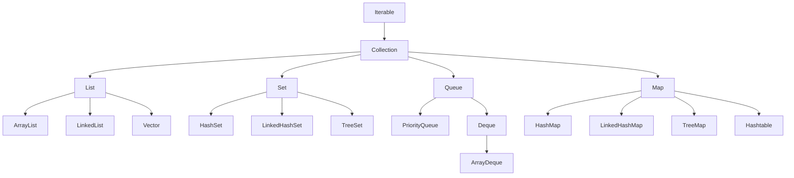

---

## 2️⃣ Memory & Internal Implementation

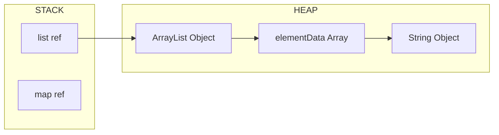

**Key Concepts:**
- Stack holds references
- Heap holds actual objects
- ArrayList uses dynamic arrays

---

## 3️⃣ Decision Tree

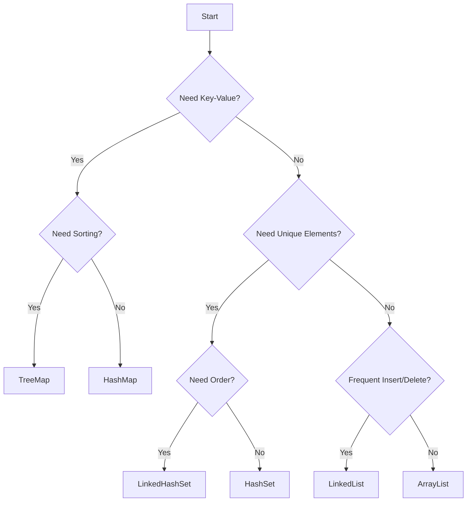

---

## 4️⃣ ArrayList

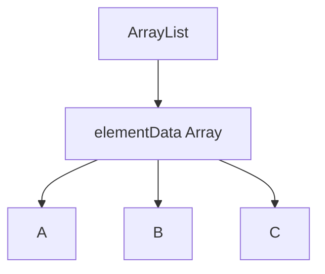

- Backed by dynamic array
- Fast random access O(1)
- Slow insert in middle O(n)

---

## 5️⃣ LinkedList

```mermaid
graph LR
    A["null"] <-->|prev| B["A"] <-->|next|
    B <-->|prev| C["B"] <-->|next|
    C <-->|prev| D["C"] <-->|next|
    D --> E["null"]
```

- Doubly linked list
- Fast insert/delete O(1)
- Slow access O(n)

---

## 6️⃣ HashSet

- Uses HashMap internally
- No duplicates
- O(1) operations

---

## 7️⃣ TreeSet

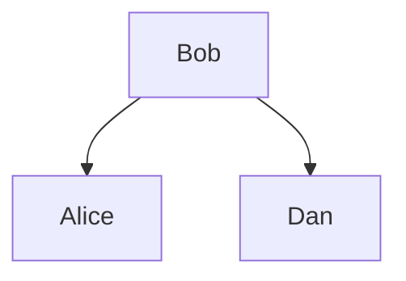

- Red-Black Tree
- Sorted order
- O(log n)

---

## 8️⃣ HashMap

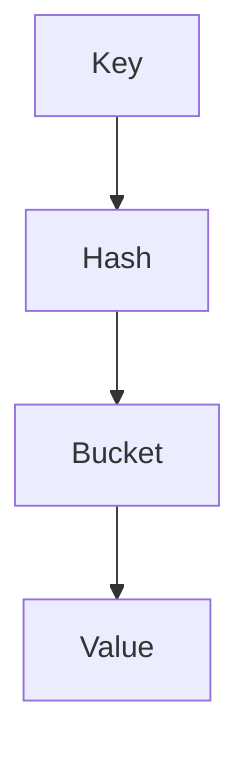

- Key-value storage
- O(1) average

---

## 9️⃣ Collision Handling

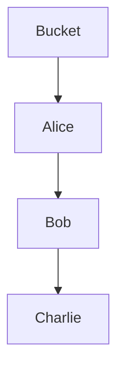

- Uses chaining
- Converts to tree after threshold

---

## 🔟 Resizing

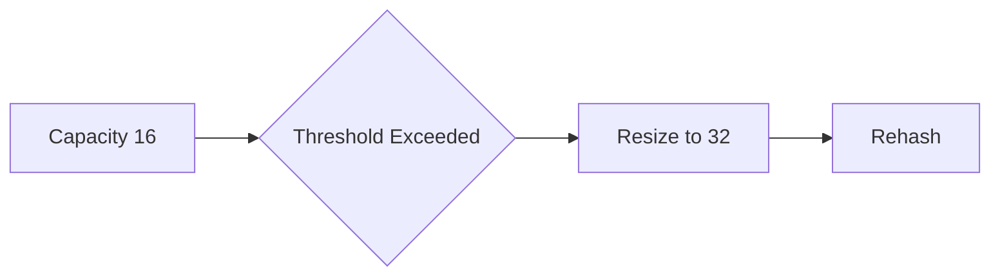

---

## 1️⃣1️⃣ PriorityQueue

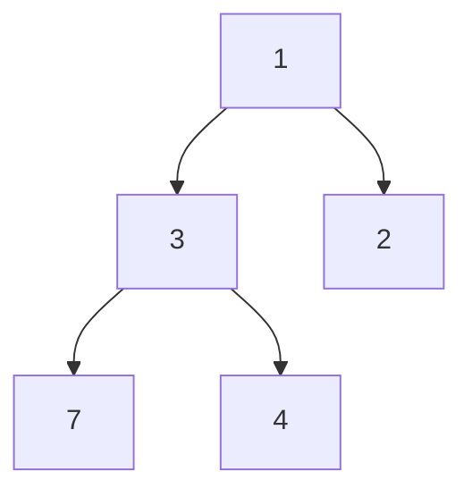

- Min Heap
- O(log n)

---

## 1️⃣2️⃣ ArrayDeque

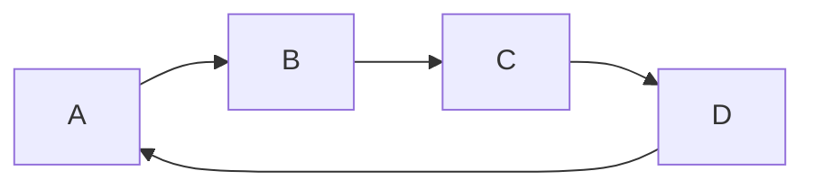

- Circular buffer
- Fast operations both ends

---

## 1️⃣3️⃣ HashCode & Equals

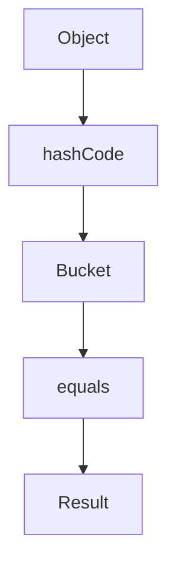

**Rules:**
- Equal objects must have same hashCode
- Always override both

---

## 1️⃣4️⃣ Garbage Collection

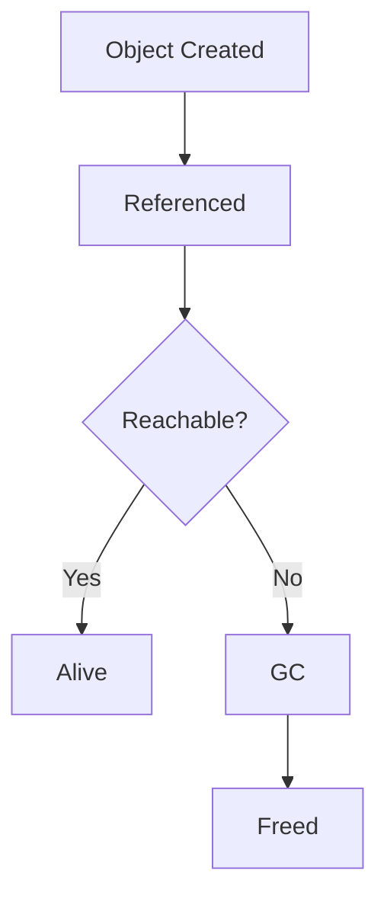

---

## 🚀 Summary

| Type | Best Use |
|------|---------|
| ArrayList | Fast read |
| LinkedList | Frequent insert/delete |
| HashSet | Unique fast lookup |
| TreeSet | Sorted data |
| HashMap | Fast key-value |
| TreeMap | Sorted map |
| PriorityQueue | Priority processing |
| ArrayDeque | Stack/Queue |

---

## 🔥 Final Tip

> Default choice:  
- List → ArrayList  
- Set → HashSet  
- Map → HashMap  

Switch only when needed 🚀
