# Java Streams: Ultimate Deep Dive Interview Prep Guide

> A comprehensive reference for mastering Java Streams (java.util.stream) including architecture, operations, performance, concurrency, and advanced patterns. Verified against official Java documentation and tested on Java 8+.

---

## Table of Contents

1. [Streams Fundamentals](#streams-fundamentals)
2. [Stream Pipeline Architecture](#stream-pipeline-architecture)
3. [Stream Creation Methods](#stream-creation-methods)
4. [Intermediate Operations](#intermediate-operations)
5. [Terminal Operations](#terminal-operations)
6. [Collectors & Collection](#collectors--collection)
7. [Map vs FlatMap Deep Dive](#map-vs-flatmap-deep-dive)
8. [Sequential vs Parallel Streams](#sequential-vs-parallel-streams)
9. [Performance & Complexity](#performance--complexity)
10. [Advanced Topics](#advanced-topics)
11. [Classic Interview Questions](#classic-interview-questions)
12. [Best Practices & Patterns](#best-practices--patterns)

---

## Streams Fundamentals

### What Are Java Streams?

A **Stream** is a sequence of elements supporting sequential and parallel aggregate operations. According to the official Java documentation (`java.util.stream.Stream`), streams are **not data structures** but rather a **view of a sequence of elements** that supports functional-style operations.

```mermaid
graph TD
    A["What is a Stream?"]
    
    %% Section: Not a Data Structure
    A --> B("1. Not a Data Structure")
    B --> B1["No Storage / Memory"]
    B --> B2["Backed by Source (List, Array)"]
    B --> B3["Lazy Evaluation"]
    
    %% Section: Functional Pipeline
    A --> C("2. Functional Pipeline")
    C --> C1["Source → Intermediate → Terminal"]
    C --> C2["Lazy Composition"]
    C --> C3["Single Traversal Only"]
    
    %% Section: Key Properties
    A --> D("3. Key Properties")
    D --> D1["Immutable Operations"]
    D --> D2["Intermediate are Lazy"]
    D --> D3["Terminals are Eager"]
    D --> D4["Cannot Reuse Stream"]
    
    %% Section: Capabilities
    A --> E("4. Capabilities")
    E --> E1["Sequential Processing"]
    E --> E2["Parallel Processing"]
    E --> E3["Functional Composition"]
    E --> E4["Optional Support"]

    %% Styling for better readability
    style A fill:#f9f,stroke:#333,stroke-width:4px
    style B fill:#e3f2fd
    style C fill:#fff3e0
    style D fill:#f3e5f5
    style E fill:#e8f5e9
    
    style B1 fill:#bbdefb
    style C2 fill:#bbdefb
    style E1 fill:#c8e6c9
    style E2 fill:#c8e6c9
```

### Stream vs Iterator: Key Differences

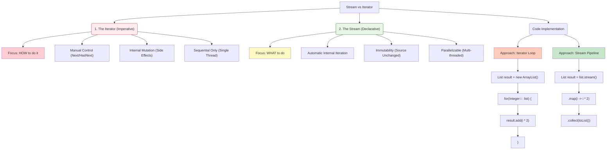
Note:
External vs. Internal Iteration: With Iterators, you pull the data (external). With Streams, the library pushes the data through the pipeline (internal).

Boilerplate: Notice how the Iterator approach requires initializing a result list and manually adding to it. The Stream approach handles the collection internally via collect().

Optimization: Because Streams handle the iteration, the JVM can optimize the process (like lazy evaluation or parallel execution) in ways a standard for-each loop cannot easily do.

### Core Concepts: Source, Intermediate, Terminal

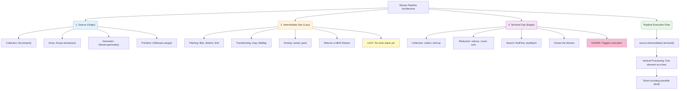
To make this "Ultimate Deep Dive" both readable and high-impact, I’ve organized the most complex internal concepts into a structured, **"Level-by-Level"** guide. This is exactly how you should explain it in a top-tier interview to show you understand the "Black Box" of Java.

---

#### 🟢 Level 1: The Lifecycle (The "Pipeline" Model)
Before any data moves, Java builds a **Linked List of Stages**. Each operation (`filter`, `map`, etc.) is a node in this list.

* **The Construction:** When you write `.filter().map()`, Java is just "wiring" the pipes. No data is flowing yet.
* **The Ignition:** The **Terminal Operation** is the only thing that "turns on the tap." It starts a process called **"Sink Chain"** construction.
* **The Sink:** A `Sink` is an internal interface with three states:
    1.  `begin(size)`: "Prepare for $N$ elements."
    2.  `accept(value)`: "Here is one piece of data; process it."
    3.  `end()`: "No more data; clean up or trigger final logic (like sorting)."


---

#### 🟡 Level 2: The Flow Engine (Vertical Processing)
Most people think Streams work like SQL (process all rows for Column A, then all for Column B). **They don't.**

* **Verticality:** Element #1 travels through the *entire* pipeline (Filter $\rightarrow$ Map $\rightarrow$ Collect) before Element #2 even leaves the source.
* **Why this matters:** This enables **Short-Circuiting**. If you have `.limit(5)`, once the 5th element hits the "Terminal Sink," it sends a signal back up the chain to **stop the source** immediately.


---

#### 🟠 Level 3: The Complexity Gates (Stateless vs. Stateful)
This is where memory management happens. In an interview, mention **"Stateful Barriers."**

#### Stateless Operations (`filter`, `map`)
* **Behavior:** Like a high-speed highway. Data passes through without stopping.
* **Memory:** $O(1)$ overhead.
* **Parallelism:** Extremely fast; no coordination needed between threads.

#### Stateful Operations (`sorted`, `distinct`, `limit`)
* **Behavior:** Like a **Dam** in a river. 
* **The Barrier:** `sorted()` cannot give you the first sorted element until it has seen the **last** element from the source. It "buffers" everything into an internal array.
* **The Danger:** If the source is infinite (e.g., `Stream.generate()`), a stateful operation will buffer until you hit an `OutOfMemoryError`.


---

#### 🔴 Level 4: The Parallel Engine (Spliterators & ForkJoin)
When you call `.parallelStream()`, Java uses the **ForkJoin Framework**.

1.  **Splitting:** The `Spliterator` uses `trySplit()` to recursively divide the data (e.g., an `ArrayList` of 1000 becomes two chunks of 500, then four of 250).
2.  **The Pool:** All parallel streams by default use the `ForkJoinPool.commonPool()`. 
    * *Deep Dive Warning:* If you run a blocking I/O operation (like calling a slow API in Mumbai) inside a parallel stream, you block the **entire JVM's common pool**, slowing down every other part of your app.
3.  **Order:** Parallel streams lose "Encounter Order" unless you specifically use `forEachOrdered()`.


---

#### 🔵 Level 5: Optimization Secrets (JIT & Fusion)
Java’s compiler (JIT) performs **Loop Fusion**. 

If you have multiple stateless operations, the JVM **fuses** them into a single pass. Instead of:
1. Loop to filter
2. Loop to map
It generates code that behaves like a single `for` loop with an `if` statement inside. This reduces "Method Call" overhead and keeps data in the CPU's L1/L2 cache (Temporal Locality).

---

#### 🏁 Summary Checklist for Interviews

| Feature | Deep Dive Detail | Interview Impact |
| :--- | :--- | :--- |
| **Identity** | Streams are **Views**, not Containers. | They don't store data; they "process on the fly." |
| **Efficiency** | **Lazy Evaluation** + **Loop Fusion**. | Minimizes CPU cycles and memory passes. |
| **Limitation** | **Single Traversal**. | Once a terminal op is called, the pipeline is destroyed. |
| **Parallelism** | **Spliterator** + **CommonPool**. | Great for CPU-heavy tasks; dangerous for I/O tasks. |

---


### Important Contract Rules

```mermaid
graph TD
    A["Stream Contract Rules"]
    
    B["Single Traversal"] --> B1["Stream cannot be reused"]
    B --> B2["Once terminal op executed"]
    B --> B3["Stream is closed"]
    B --> B4["Reusing throws IllegalStateException"]
    
    C["Laziness of Intermediate Ops"] --> C1["filter(pred) doesn't filter"]
    C --> C2["map(fn) doesn't transform"]
    C --> C3["Just builds pipeline"]
    C --> C4["Only executed when terminal called"]
    
    D["Stream Order"] --> D1["Sequential: encounter order preserved"]
    D --> D2["Parallel: encounter order lost"]
    D --> D3["Unless operation is ordered"]
    D --> D4["Example: distinct() is stateful"]
    
    E["Interference & Side Effects"] --> E1["Avoid modifying source"]
    E --> E2["Avoid stateful predicates"]
    E --> E3["Avoid side effects in map/filter"]
    E --> E4["Can cause undefined behavior"]
    
    style B1 fill:#ffcccc
    style C4 fill:#fff9c4
    style D2 fill:#ffccbc
    style E4 fill:#ffcccc
```

---

## Stream Pipeline Architecture

### How Streams Are Evaluated

```mermaid
graph TD
    A["Stream Evaluation Mechanism"]
    
    B["Declaration Phase"] --> B1["List<Integer> = [1,2,3,4,5]"]
    B --> B2["stream.filter(x -> x > 2)"]
    B --> B3["At this point: NOTHING happens"]
    B --> B4["Pipeline is composed"]
    
    C["Lazy Evaluation"] --> C1["Intermediate ops stored"]
    C --> C2["No iteration started"]
    C --> C3["No filtering applied"]
    C --> C4["Memory efficient"]
    
    D["Terminal Operation Called"] --> D1[".collect(toList())"]
    D --> D2["NOW pipeline executes"]
    D --> D3["Element 1: check filter"]
    D --> D4["Element 2: check filter"]
    D --> D5["Continue until source exhausted"]
    
    E["Actual Execution Order"] --> E1["Per-element processing"]
    E --> E2["Not operation-by-operation"]
    E --> E3["Filter 1 → Map 1 → Collect 1"]
    E --> E4["Then Filter 2 → Map 2 → Collect 2"]
    E --> E5["Enables short-circuiting"]
    
    style B3 fill:#fff9c4
    style D2 fill:#c8e6c9
    style E5 fill:#c8e6c9
```

### Example: Visible Laziness

```mermaid
graph TD
    A["Laziness Example"]
    
    B["Code Execution"] --> B1["Stream<Integer> stream ="]
    B --> B2["  list.stream()"]
    B --> B3["  .peek(x -> System.out.println('Peek: ' + x))"]
    B --> B4["  .filter(x -> x > 2)"]
    B --> B5["  .peek(x -> System.out.println('After filter: ' + x))"]
    B --> B6["  .map(x -> x * 2)"]
    B --> B7["NOTHING PRINTED YET!"]
    
    C["Terminal Called"] --> C1[".forEach(System.out::println)"]
    C --> C2["NOW outputs:"]
    C --> C3["Peek: 1"]
    C --> C4["Peek: 2"]
    C --> C5["Peek: 3, After filter: 3"]
    C --> C6["Peek: 4, After filter: 4"]
    C --> C7["Peek: 5, After filter: 5"]
    
    D["Why This Order?"] --> D1["Per-element pipeline"]
    D --> D2["Element 1: filter fails, stop"]
    D --> D3["Element 3: filter passes, continue"]
    D --> D4["Results in efficient execution"]
    
    style B7 fill:#fff9c4
    style C2 fill:#c8e6c9
```

---

## Stream Creation Methods

### All Ways to Create Streams

```mermaid
graph TD
    A["Stream Creation Sources"]
    
    B["From Collections"]
    B --> B1["list.stream()"]
    B --> B2["set.stream()"]
    B --> B3["collection.stream()"]
    
    C["From Arrays"]
    C --> C1["Arrays.stream(array)"]
    C --> C2["Arrays.stream(array, start, end)"]
    C --> C3["array of primitive type"]
    
    D["From Strings"]
    D --> D1["Pattern.compile(regex).splitAsStream(string)"]
    D --> D2["string.chars() → IntStream"]
    D --> D3["string.codePoints() → IntStream"]
    
    E["Generating Streams"]
    E --> E1["Stream.of(T... values)"]
    E --> E2["Stream.generate(Supplier<T>)"]
    E --> E3["Stream.iterate(seed, UnaryOperator)"]
    E --> E4["Stream.iterate(seed, Predicate, UnaryOperator)"]
    
    F["Builder Pattern"]
    F --> F1["Stream.builder().add(1).add(2).build()"]
    
    G["Primitive Streams"]
    G --> G1["IntStream.range(0, 10)"]
    G --> G2["IntStream.rangeClosed(0, 10)"]
    G --> G3["LongStream.range()"]
    G --> G4["DoubleStream.of()"]
    
    H["Files & I/O"]
    H --> H1["Files.lines(Path)"]
    H --> H2["BufferedReader.lines()"]
    
    I["Other Sources"]
    I --> I1["Random.ints()"]
    I --> I2["Random.doubles()"]
    I --> I3["Spliterator to Stream"]
    
    style B1 fill:#e3f2fd
    style C1 fill:#e3f2fd
    style E2 fill:#fff3e0
    style G1 fill:#c5cae9
```

### Stream Creation: Detailed Examples

```java
// 1. From Collection (most common)
List<Integer> list = Arrays.asList(1, 2, 3);
Stream<Integer> stream = list.stream();

// 2. From Array
int[] array = {1, 2, 3, 4, 5};
IntStream stream = Arrays.stream(array);
Stream<Integer> boxedStream = Arrays.stream(array).boxed();

// 3. Stream.of() - varargs
Stream<String> stream = Stream.of("a", "b", "c");

// 4. Empty Stream
Stream<Integer> empty = Stream.empty();

// 5. Stream.generate() - infinite stream
Stream<Double> randoms = Stream.generate(Math::random).limit(10);

// 6. Stream.iterate() - infinite stream with state
Stream<Integer> numbers = Stream.iterate(0, n -> n + 1).limit(10);
// Result: 0, 1, 2, 3, 4, 5, 6, 7, 8, 9

// Java 9+: Stream.iterate with predicate (terminal condition)
Stream<Integer> counted = Stream.iterate(0, n -> n < 10, n -> n + 1);

// 7. String to Stream
String str = "Hello";
IntStream chars = str.chars();  // Stream of character codes
str.chars().forEach(c -> System.out.println((char) c));  // H, e, l, l, o

// 8. Regex split to Stream
String text = "apple,banana,cherry";
Stream<String> words = Pattern.compile(",").splitAsStream(text);

// 9. Files
Path path = Paths.get("file.txt");
Stream<String> lines = Files.lines(path);

// 10. Primitive Stream
IntStream range = IntStream.range(0, 10);      // 0 to 9
IntStream rangeClosed = IntStream.rangeClosed(0, 10);  // 0 to 10
```

---

## Intermediate Operations

### Complete Reference Table

```mermaid
graph TD
    A["Intermediate Operations Reference"]
    
    B["Filtering & Selection"]
    B --> B1["filter(Predicate): keep matching"]
    B --> B2["distinct(): remove duplicates"]
    B --> B3["limit(n): take first n"]
    B --> B4["skip(n): skip first n"]
    
    C["Transformation"]
    C --> C1["map(Function): one-to-one"]
    C --> C2["mapToInt/Long/Double"]
    C --> C3["flatMap(Function): flatten"]
    C --> C4["flatMapToInt/Long/Double"]
    
    D["Inspection & Debugging"]
    D --> D1["peek(Consumer): side effect"]
    D --> D2["Does NOT modify stream"]
    D --> D3["Used for debugging"]
    
    E["Ordering"]
    E --> E1["sorted(): natural order"]
    E --> E2["sorted(Comparator): custom"]
    
    F["Type Conversion"]
    F --> F1["boxed(): primitive to object"]
    F --> F2["asDoubleStream()"]
    F --> F3["asLongStream()"]
    
    G["Key Characteristics"]
    G --> G1["All return Stream"]
    G --> G2["All are lazy"]
    G --> G3["Can be chained"]
    G --> G4["Don't execute until terminal"]
    
    style B1 fill:#fff3e0
    style C1 fill:#fff3e0
    style G4 fill:#fff9c4
```

### Detailed Intermediate Operations

#### 1. filter() - Predicate-based Selection

```java
// Remove elements not matching condition
List<Integer> numbers = Arrays.asList(1, 2, 3, 4, 5, 6);
List<Integer> evens = numbers.stream()
    .filter(n -> n % 2 == 0)
    .collect(toList());
// Result: [2, 4, 6]

// Multiple filters (chained)
List<String> words = Arrays.asList("apple", "apricot", "banana", "blueberry");
List<String> filtered = words.stream()
    .filter(w -> w.startsWith("a"))      // filter 1
    .filter(w -> w.length() > 5)         // filter 2
    .collect(toList());
// Result: ["apricot"]

// Performance note: filter is lazy, stops at first matching element
Stream<Integer> stream = numbers.stream()
    .filter(n -> {
        System.out.println("Checking: " + n);
        return n > 3;
    })
    .limit(2);
// Prints: Checking: 1, Checking: 2, Checking: 3, Checking: 4, Checking: 5
// (Note: filter must check elements until it has 2 matches)
```

#### 2. map() - Transform Elements

```java
// Transform each element
List<String> words = Arrays.asList("hello", "world");
List<Integer> lengths = words.stream()
    .map(String::length)
    .collect(toList());
// Result: [5, 5]

// Type transformation
List<Integer> numbers = Arrays.asList(1, 2, 3);
List<String> strings = numbers.stream()
    .map(Object::toString)
    .collect(toList());
// Result: ["1", "2", "3"]

// Chain transformations
List<Integer> result = Arrays.asList(1, 2, 3)
    .stream()
    .map(n -> n * 2)      // 2, 4, 6
    .map(n -> n + 10)     // 12, 14, 16
    .collect(toList());

// Map to primitive streams
List<String> words = Arrays.asList("a", "ab", "abc");
IntStream lengths = words.stream().mapToInt(String::length);
// Can be converted back: lengths.boxed().collect(toList())
```

#### 3. flatMap() - Flatten Nested Streams

```mermaid
graph TD
    A["flatMap: Flatten Nested Streams"]
    
    B["Input"] --> B1["List<List<Integer>>"]
    B --> B2["[[1,2], [3,4], [5]]"]
    
    C["Without flatMap: map()"] --> C1["Stream<List<Integer>>"]
    C --> C2["Still nested, not useful"]
    
    D["With flatMap"] --> D1["Each inner list → Stream"]
    D --> D2["All streams merged"]
    D --> D3["Stream<Integer>"]
    D --> D4["[1,2,3,4,5]"]
    
    E["Signature"] --> E1["Stream<R> flatMap(Function<T, Stream<R>>)"]
    E --> E2["Function returns Stream (not T)"]
    E --> E3["Streams are flattened to one"]
    
    F["Use Cases"] --> F1["Nested collections"]
    F --> F2["Multiple outputs per input"]
    F --> F3["Extracting from complex structures"]
    F --> F4["Optional.stream() mapping"]
    
    style D4 fill:#c8e6c9
    style E2 fill:#fff9c4
```

```java
// Classic flatMap: flatten nested collections
List<List<Integer>> nested = Arrays.asList(
    Arrays.asList(1, 2),
    Arrays.asList(3, 4),
    Arrays.asList(5)
);

List<Integer> flattened = nested.stream()
    .flatMap(List::stream)      // Each List becomes Stream
    .collect(toList());
// Result: [1, 2, 3, 4, 5]

// Real-world: user with multiple orders
class User {
    String name;
    List<Order> orders;
}

List<User> users = Arrays.asList(
    new User("Alice", Arrays.asList(order1, order2)),
    new User("Bob", Arrays.asList(order3))
);

// Get all orders from all users
List<Order> allOrders = users.stream()
    .flatMap(user -> user.getOrders().stream())
    .collect(toList());

// With Optional: might return empty stream
List<String> emails = users.stream()
    .flatMap(user -> Optional.ofNullable(user.getEmail()).stream())
    .collect(toList());

// flatMapToInt: return IntStream
List<String> words = Arrays.asList("hello", "world");
int totalChars = words.stream()
    .flatMapToInt(word -> word.chars())
    .sum();
// Result: 10 (5 + 5)

// Vs map: shows the difference
// map returns: Stream<Stream<Integer>>
// flatMap returns: Stream<Integer>
List<Stream<Integer>> mapped = nested.stream()
    .map(List::stream)
    .collect(toList());
// Result: [Stream(1,2), Stream(3,4), Stream(5)]
// Not useful! This is why flatMap exists
```

#### 4. distinct() - Remove Duplicates

```java
// Remove duplicate elements
List<Integer> numbers = Arrays.asList(1, 2, 2, 3, 3, 3, 4);
List<Integer> unique = numbers.stream()
    .distinct()
    .collect(toList());
// Result: [1, 2, 3, 4]

// With custom objects - uses equals()
class Person {
    String name;
    int age;
    // Must override equals() and hashCode()
    @Override
    public boolean equals(Object o) { ... }
    @Override
    public int hashCode() { ... }
}

List<Person> people = Arrays.asList(
    new Person("Alice", 30),
    new Person("Bob", 25),
    new Person("Alice", 30)  // duplicate
);

List<Person> unique = people.stream()
    .distinct()  // Uses equals/hashCode
    .collect(toList());
// Result: 2 people

// Performance note: distinct() is stateful
// Must remember all seen elements
// O(n) space complexity
```

#### 5. sorted() - Order Elements

```java
// Natural order
List<Integer> numbers = Arrays.asList(3, 1, 4, 1, 5, 9);
List<Integer> sorted = numbers.stream()
    .sorted()
    .collect(toList());
// Result: [1, 1, 3, 4, 5, 9]

// Custom comparator
List<String> words = Arrays.asList("apple", "pie", "banana");
List<String> byLength = words.stream()
    .sorted(Comparator.comparingInt(String::length))
    .collect(toList());
// Result: ["pie", "apple", "banana"]

// Reverse order
List<Integer> descending = numbers.stream()
    .sorted(Comparator.reverseOrder())
    .collect(toList());
// Result: [9, 5, 4, 3, 1, 1]

// Multiple criteria
class Person {
    String name;
    int age;
}

List<Person> people = ...;
List<Person> sorted = people.stream()
    .sorted(Comparator
        .comparingInt(Person::getAge)
        .thenComparing(Person::getName))
    .collect(toList());

// Performance warning: sorted() is expensive
// Creates internal array, O(n log n) time, O(n) space
// Use only when necessary
```

#### 6. limit() & skip() - Pagination

```java
// limit(n): take first n elements
List<Integer> numbers = Arrays.asList(1, 2, 3, 4, 5);
List<Integer> first3 = numbers.stream()
    .limit(3)
    .collect(toList());
// Result: [1, 2, 3]

// skip(n): skip first n elements
List<Integer> last2 = numbers.stream()
    .skip(3)
    .collect(toList());
// Result: [4, 5]

// Pagination pattern
int pageSize = 2;
int pageNumber = 1;  // 0-indexed

List<Integer> page = numbers.stream()
    .skip((long) pageNumber * pageSize)
    .limit(pageSize)
    .collect(toList());
// pageNumber=1: skip 2, limit 2 → [3, 4]

// limit enables short-circuiting
// Stops processing once n elements collected
Stream<Integer> infinite = Stream.iterate(0, n -> n + 1);
List<Integer> first5 = infinite
    .limit(5)
    .collect(toList());
// Result: [0, 1, 2, 3, 4] (doesn't infinite loop!)
```

#### 7. peek() - Debugging Intermediate Operations

```java
// peek() executes consumer but doesn't modify stream
List<Integer> result = Arrays.asList(1, 2, 3)
    .stream()
    .peek(n -> System.out.println("Before filter: " + n))
    .filter(n -> n > 1)
    .peek(n -> System.out.println("After filter: " + n))
    .map(n -> n * 2)
    .peek(n -> System.out.println("After map: " + n))
    .collect(toList());

// Output:
// Before filter: 1
// Before filter: 2
// After filter: 2
// After map: 4
// Before filter: 3
// After filter: 3
// After map: 6

// Common mistake: using peek for transformation
List<Integer> numbers = Arrays.asList(1, 2, 3);
numbers.stream()
    .peek(n -> n * 2)  // WRONG: doesn't change anything
    .collect(toList());  // Result: [1, 2, 3] unchanged

// Correct: use map for transformation
numbers.stream()
    .map(n -> n * 2)  // RIGHT: transforms
    .collect(toList());  // Result: [2, 4, 6]

// peek() is for side effects (debugging, logging)
```

---

## Terminal Operations

### Complete Reference & Decision Tree

```mermaid
graph TD
    A["Terminal Operations Reference"]
    
    B["Collection Operations"]
    B --> B1["collect(Collector): custom collection"]
    B --> B2["toList(), toSet(), toMap()"]
    
    C["Single Value Operations"]
    C --> C1["reduce(): combine to one value"]
    C --> C2["count(): number of elements"]
    C --> C3["min/max(): extremes"]
    
    D["Search/Match Operations"]
    D --> D1["anyMatch(Predicate): OR logic"]
    D --> D2["allMatch(Predicate): AND logic"]
    D --> D3["noneMatch(Predicate): NOT logic"]
    D --> D4["findFirst(): optional element"]
    D --> D5["findAny(): optional element"]
    
    E["Side Effect Operations"]
    E --> E1["forEach(Consumer): iterate"]
    E --> E2["forEachOrdered(): preserve order"]
    
    F["Array Operations"]
    F --> F1["toArray(): Object[]"]
    F --> F2["toArray(IntFunction): typed[]"]
    
    G["Decision: Which To Use?"]
    G --> G1["Want result? → collect/reduce"]
    G --> G2["Want count? → count"]
    G --> G3["Want match? → anyMatch/allMatch"]
    G --> G4["Want element? → findFirst"]
    G --> G5["Just iterate? → forEach"]
    
    style C1 fill:#f3e5f5
    style D1 fill:#c5cae9
    style E1 fill:#ffccbc
```

### Detailed Terminal Operations

#### 1. collect() - The Most Important Terminal Operation

```mermaid
graph TD
    A["collect() Architecture"]
    
    B["What It Does"] --> B1["Accumulates elements"]
    B --> B2["Into mutable result container"]
    B --> B3["Returns final result"]
    
    C["Signature"] --> C1["<R,A> R collect(Collector<T,A,R>)"]
    C --> C2["T: stream element type"]
    C --> C3["A: accumulator type"]
    C --> C4["R: result type"]
    
    D["Three-Part Collector"] --> D1["supplier(): create container"]
    D --> D2["accumulator(): add element"]
    D --> D3["combiner(): merge (parallel)"]
    
    E["Common Collectors"] --> E1["toList(), toSet(), toMap()"]
    E --> E2["groupingBy(), partitioningBy()"]
    E --> E3["joining(), counting()"]
    E --> E4["minBy(), maxBy()"]
    
    F["Built-in Examples"] --> F1["list.stream().collect(toList())"]
    F --> F2["list.stream().collect(toSet())"]
    F --> F3["list.stream().collect(groupingBy(fn))"]
    
    style D1 fill:#fff9c4
    style E1 fill:#c8e6c9
```

```java
// 1. toList() - collect to List
List<String> words = Arrays.asList("apple", "banana", "cherry");
List<String> result = words.stream()
    .filter(w -> w.length() > 5)
    .collect(Collectors.toList());
// Result: ["banana", "cherry"]

// 2. toSet() - remove duplicates and collect
List<Integer> numbers = Arrays.asList(1, 2, 2, 3, 3, 3);
Set<Integer> unique = numbers.stream()
    .collect(Collectors.toSet());
// Result: {1, 2, 3}

// 3. toMap() - create map from stream
List<String> words = Arrays.asList("a", "bb", "ccc");
Map<String, Integer> lengths = words.stream()
    .collect(Collectors.toMap(
        Function.identity(),        // key: the word itself
        String::length              // value: length
    ));
// Result: {a=1, bb=2, ccc=3}

// 4. groupingBy() - group by classifier function
List<String> words = Arrays.asList("apple", "apricot", "banana", "blueberry");
Map<Character, List<String>> byFirstLetter = words.stream()
    .collect(Collectors.groupingBy(w -> w.charAt(0)));
// Result: {a=[apple, apricot], b=[banana, blueberry]}

// 5. partitioningBy() - split true/false
List<Integer> numbers = Arrays.asList(1, 2, 3, 4, 5);
Map<Boolean, List<Integer>> evenOdd = numbers.stream()
    .collect(Collectors.partitioningBy(n -> n % 2 == 0));
// Result: {false=[1,3,5], true=[2,4]}

// 6. joining() - concatenate strings
List<String> words = Arrays.asList("hello", "world");
String result = words.stream()
    .collect(Collectors.joining(", "));
// Result: "hello, world"

// 7. counting() - count elements
long count = words.stream()
    .collect(Collectors.counting());
// Result: 2

// 8. maxBy() / minBy() - find extreme
List<String> words = Arrays.asList("a", "bb", "ccc");
Optional<String> longest = words.stream()
    .collect(Collectors.maxBy(Comparator.comparingInt(String::length)));
// Result: Optional["ccc"]

// 9. Custom collector - create custom container
List<String> result = words.stream()
    .collect(
        ArrayList::new,           // supplier: create list
        List::add,                // accumulator: add element
        List::addAll              // combiner: merge lists
    );
```

#### 2. reduce() - Combine to Single Value

```java
// Signature: Optional<T> reduce(BinaryOperator<T> accumulator)
List<Integer> numbers = Arrays.asList(1, 2, 3, 4, 5);

// Sum using reduce
Optional<Integer> sum = numbers.stream()
    .reduce((a, b) -> a + b);
// Result: Optional[15]

// Product using reduce
Optional<Integer> product = numbers.stream()
    .reduce((a, b) -> a * b);
// Result: Optional[120]

// With initial value: T reduce(T identity, BinaryOperator<T>)
int sum = numbers.stream()
    .reduce(0, (a, b) -> a + b);
// Result: 15

// With initial value and type transformation
String result = words.stream()
    .reduce("", (a, b) -> a + ", " + b);
// Result: ", apple, banana, cherry" (note leading comma)

// Better string reduction:
String result = words.stream()
    .collect(Collectors.joining(", "));

// Three-argument reduce: for parallel streams
// int sum = numbers.stream()
//     .reduce(0, Integer::sum, Integer::sum);

// Difference: Optional vs Default
Optional<Integer> max1 = empty.stream().reduce(Math::max);  // empty: Optional.empty()
int max2 = empty.stream().reduce(-1, Math::max);  // -1 returned for empty
```

#### 3. Match Operations - anyMatch, allMatch, noneMatch

```java
// anyMatch() - OR: at least one matches
List<Integer> numbers = Arrays.asList(1, 2, 3, 4, 5);
boolean hasEven = numbers.stream()
    .anyMatch(n -> n % 2 == 0);  // true
boolean hasNegative = numbers.stream()
    .anyMatch(n -> n < 0);  // false

// allMatch() - AND: all must match
boolean allPositive = numbers.stream()
    .allMatch(n -> n > 0);  // true
boolean allEven = numbers.stream()
    .allMatch(n -> n % 2 == 0);  // false

// noneMatch() - NOT: none match
boolean noNegative = numbers.stream()
    .noneMatch(n -> n < 0);  // true
boolean noZero = numbers.stream()
    .noneMatch(n -> n == 0);  // true

// Performance: short-circuit operations
// anyMatch stops at first match
// allMatch stops at first non-match
// noneMatch stops at first match

// Example: password validation
String password = "MyPass123!";
boolean strong = password.chars()
    .allMatch(c -> Character.isLetterOrDigit(c) || "!@#$%".indexOf(c) >= 0);
```

#### 4. Search Operations - findFirst, findAny

```java
// findFirst() - first matching element
List<Integer> numbers = Arrays.asList(1, 2, 3, 4, 5);
Optional<Integer> first = numbers.stream()
    .filter(n -> n > 2)
    .findFirst();
// Result: Optional[3]

// findFirst with ordered stream: always same
Optional<String> result1 = list.stream().filter(...).findFirst();
Optional<String> result2 = list.stream().filter(...).findFirst();
// Same result both times

// findAny() - any matching element
Optional<Integer> any = numbers.stream()
    .filter(n -> n > 2)
    .findAny();
// Result: Optional[3] in sequential
// Result: could be [3], [4], or [5] in parallel

// findAny useful for parallel streams
// Doesn't require ordering overhead
Optional<Integer> anyParallel = numbers.parallelStream()
    .filter(n -> n > 2)
    .findAny();  // faster than findFirst

// Working with Optional
Optional<String> name = findUserName(123);
if (name.isPresent()) {
    System.out.println(name.get());
} else {
    System.out.println("Not found");
}

// Better: use Optional methods
findUserName(123)
    .ifPresent(System.out::println);

// With default
String result = findUserName(123)
    .orElse("Unknown");
```

#### 5. Other Terminal Operations

```java
// count() - number of elements
long count = numbers.stream()
    .filter(n -> n % 2 == 0)
    .count();

// min() / max() - extremes
Optional<Integer> min = numbers.stream()
    .min(Comparator.naturalOrder());
Optional<Integer> max = numbers.stream()
    .max(Comparator.reverseOrder());

// forEach() - iterate (side effects)
numbers.stream()
    .forEach(System.out::println);

// forEachOrdered() - respect encounter order (parallel)
numbers.parallelStream()
    .forEachOrdered(System.out::println);  // prints in original order

// toArray() - convert to array
Integer[] array = numbers.stream()
    .toArray(Integer[]::new);

String[] stringArray = words.stream()
    .toArray(String[]::new);
```

---

## Collectors & Collection

### Advanced Collectors Reference

```mermaid
graph TD
    A["Collectors Overview"]
    
    B["Simple Collectors"]
    B --> B1["toList(), toSet(), toMap()"]
    B --> B2["toCollection(Supplier)"]
    
    C["Reduction Collectors"]
    C --> C1["counting()"]
    C --> C2["summingInt/Long/Double()"]
    C --> C3["averagingInt/Long/Double()"]
    C --> C4["minBy(), maxBy()"]
    
    D["Grouping Collectors"]
    D --> D1["groupingBy(classifier)"]
    D --> D2["groupingBy(classifier, downstream)"]
    D --> D3["partitioningBy(predicate)"]
    
    E["String Collectors"]
    E --> E1["joining(delimiter)"]
    E --> E2["joining(delim, prefix, suffix)"]
    
    F["Mapping Collectors"]
    F --> F1["mapping(mapper, collector)"]
    F --> F2["flatMapping(mapper, collector) Java 9+"]
    F --> F3["filtering(predicate, collector) Java 9+"]
    
    G["Composition"]
    G --> G1["Collectors compose for complex queries"]
    G --> G2["Nested grouping, filtering, reduction"]
    
    style D1 fill:#c5cae9
    style E1 fill:#c8e6c9
```

```java
// 1. Grouping with multiple levels
class Person { String dept; String name; }
List<Person> people = ...;

Map<String, List<String>> byDept = people.stream()
    .collect(groupingBy(
        Person::getDept,
        mapping(Person::getName, toList())
    ));

// 2. Grouping with counting
Map<String, Long> countByDept = people.stream()
    .collect(groupingBy(Person::getDept, counting()));

// 3. Grouping with max value
Map<String, Optional<String>> longestByDept = people.stream()
    .collect(groupingBy(
        Person::getDept,
        maxBy(Comparator.comparingInt(Person::getName))
    ));

// 4. Partition then further grouping
Map<Boolean, Map<String, List<String>>> partition = people.stream()
    .collect(partitioningBy(
        p -> p.getAge() > 30,
        groupingBy(Person::getDept, mapping(Person::getName, toList()))
    ));

// 5. Complex aggregation
class Sale { LocalDate date; String product; int amount; }
Map<LocalDate, Map<String, Integer>> byDateProduct = sales.stream()
    .collect(groupingBy(
        Sale::getDate,
        groupingBy(Sale::getProduct, summingInt(Sale::getAmount))
    ));
```

---

## Map vs FlatMap Deep Dive

### Complete Comparison

```mermaid
graph TD
    A["Map vs FlatMap: Detailed Comparison"]
    
    B["MAP: One-to-One"]
    B --> B1["Input: Stream<T>"]
    B --> B2["Function returns: R"]
    B --> B3["Output: Stream<R>"]
    B --> B4["Same number of elements"]
    
    C["FLATMAP: One-to-Many"]
    C --> C1["Input: Stream<T>"]
    C --> C2["Function returns: Stream<R>"]
    C --> C3["Output: Stream<R>"]
    C --> C4["Flattens all streams"]
    C --> C5["May have different count"]
    
    D["Memory/Execution"]
    D --> D1["Map: O(1) per element"]
    D --> D2["FlatMap: O(n) depends on stream size"]
    D --> D3["FlatMap creates intermediate streams"]
    
    E["Signature Difference"]
    E --> E1["map: Function<T, R>"]
    E --> E2["flatMap: Function<T, Stream<R>>"]
    
    F["When to Use"]
    F --> F1["Map: simple transformation"]
    F --> F2["FlatMap: nested structures"]
    F --> F3["FlatMap: multiple results per input"]
    
    style B4 fill:#c8e6c9
    style C4 fill:#fff9c4
    style E2 fill:#ffccbc
```

### Visual Examples

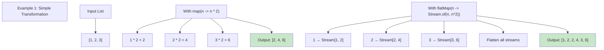

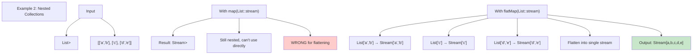

### Code Comparison

```java
// Scenario: Convert each word to its characters

List<String> words = Arrays.asList("hello", "world");

// WRONG: Using map() returns Stream<IntStream>
Stream<IntStream> chars = words.stream()
    .map(String::chars);  // IntStream per word
// Can't easily collect this

// CORRECT: Using flatMap() returns Stream<Integer>
List<Integer> allChars = words.stream()
    .flatMapToInt(String::chars)
    .boxed()
    .collect(toList());
// Result: [104,101,108,108,111,119,111,114,108,100]
// (ASCII codes for all characters)

// More practical example:
List<String> sentences = Arrays.asList(
    "Hello world",
    "Java streams"
);

// Get all words from all sentences
List<String> allWords = sentences.stream()
    .flatMap(sentence -> Stream.of(sentence.split(" ")))
    .collect(toList());
// Result: ["Hello", "world", "Java", "streams"]

// Using map would give Stream<Stream<String>>
Stream<Stream<String>> badApproach = sentences.stream()
    .map(sentence -> Stream.of(sentence.split(" ")));
// Not useful without additional flattening

// Real-world: Order with multiple items
class Order { List<Item> items; }
class Item { String name; double price; }

List<Order> orders = ...;

// Get all items from all orders
List<Item> allItems = orders.stream()
    .flatMap(order -> order.getItems().stream())
    .collect(toList());

// Get prices of all items
List<Double> allPrices = orders.stream()
    .flatMap(order -> order.getItems().stream())
    .map(Item::getPrice)
    .collect(toList());
```

---

## Sequential vs Parallel Streams

### Architecture & Behavior

```mermaid
graph TD
    A["Sequential vs Parallel Streams"]
    
    B["Sequential Stream"]
    B --> B1["Single thread processing"]
    B --> B2["Elements processed one by one"]
    B --> B3["Encounter order preserved"]
    B --> B4["Low overhead"]
    B --> B5["list.stream()"]
    
    C["Parallel Stream"]
    C --> C1["Multiple threads"]
    C --> C2["ForkJoinPool.commonPool()"]
    C --> C3["Divides into segments"]
    C --> C4["Parallel processing"]
    C --> C5["Encounter order lost"]
    C --> C6["Higher overhead"]
    C --> C7["list.parallelStream()"]
    
    D["When Sequential Better"]
    D --> D1["Small datasets"]
    D --> D2["Complex operations"]
    D --> D3["I/O operations"]
    D --> D4["Low CPU-bound tasks"]
    
    E["When Parallel Better"]
    E --> E1["Large datasets > 1000 items"]
    E --> E2["Simple, independent operations"]
    E --> E3["CPU-bound computations"]
    E --> E4["Stateless operations"]
    
    F["Shared Pool"]
    F --> F1["Default: ForkJoinPool.commonPool()"]
    F --> F2["Threads: Runtime.getRuntime().availableProcessors()"]
    F --> F3["All parallel streams share pool"]
    F --> F4["One slow task blocks others"]
    
    style B5 fill:#e3f2fd
    style C7 fill:#c5cae9
    style E1 fill:#fff9c4
```

### When to Use Parallel

```mermaid
graph TD
    A["Parallel Stream Decision"]
    
    B["Dataset Size?"]
    B --> B1["< 100 items → Sequential"]
    B --> B2["100-1000 items → Possibly"]
    B --> B3["> 1000 items → Consider parallel"]
    
    C["Operation Type?"]
    C --> C1["Stateless (filter, map) → Good for parallel"]
    C --> C2["Stateful (distinct, sorted) → Less ideal"]
    C --> C3["Terminal (reduce) → Good if stateless"]
    
    D["Data Structure?"]
    D --> D1["ArrayList, array → Excellent splitability"]
    D --> D2["LinkedList → Poor splitability"]
    D --> D3["Stream.generate → Can't split"]
    
    E["CPU vs I/O?"]
    E --> E1["CPU-bound computation → Parallel good"]
    E --> E2["I/O-bound (network, file) → Sequential better"]
    E --> E3["Mixed → Usually sequential"]
    
    F["Decision"]
    F --> F1["All Yes? → Use parallel"]
    F --> F2["Any No? → Use sequential"]
    
    style B3 fill:#c8e6c9
    style C1 fill:#c8e6c9
    style D1 fill:#c8e6c9
```

### Code Examples

```java
// Sequential stream
List<Integer> numbers = ...;
long sum = numbers.stream()
    .filter(n -> n % 2 == 0)
    .map(n -> n * n)
    .reduce(0, Integer::sum);

// Parallel stream
long sumParallel = numbers.parallelStream()
    .filter(n -> n % 2 == 0)
    .map(n -> n * n)
    .reduce(0, Integer::sum);

// Converting between sequential and parallel
Stream<Integer> seq = numbers.stream();
Stream<Integer> par = seq.parallel();
Stream<Integer> back = par.sequential();  // Back to sequential

// Performance: parallel overhead example
List<Integer> small = Arrays.asList(1, 2, 3, 4, 5);
long sum = small.parallelStream()  // Slower due to overhead!
    .reduce(0, Integer::sum);

List<Integer> large = IntStream.range(0, 1_000_000)
    .boxed()
    .collect(toList());
long sum = large.parallelStream()  // Faster due to distribution
    .reduce(0, Integer::sum);

// WARNING: Stateful operations in parallel
List<String> words = Arrays.asList("apple", "apricot", "banana");
Set<String> unique = words.parallelStream()
    .collect(Collectors.toSet());  // Safe: thread-safe collector

List<String> list = words.parallelStream()
    .collect(Collectors.toList());  // Safe: thread-safe collector

// DANGER: Shared mutable state
List<String> badList = new ArrayList<>();
words.parallelStream()
    .forEach(badList::add);  // UNSAFE! Race condition
// Correct:
List<String> goodList = words.parallelStream()
    .collect(toList());  // Safe

// Shared pool blocking issue
ExecutorService pool = Executors.newFixedThreadPool(4);
// Task 1 uses common pool
List<Integer> result = numbers.parallelStream()
    .map(n -> {
        // blocks common pool thread
        try { Thread.sleep(1000); } catch (InterruptedException e) {}
        return n * 2;
    })
    .collect(toList());
// Other parallel streams now waiting!

// Solution: custom ForkJoinPool
ForkJoinPool customPool = new ForkJoinPool(8);
List<Integer> result = customPool.invoke(
    ForkJoinTask.adapt(() -> numbers.parallelStream()
        .map(n -> n * 2)
        .collect(toList()))
);
```

---

## Performance & Complexity

### Time Complexity Analysis

```mermaid
graph TD
    A["Stream Operations Complexity"]
    
    B["Intermediate Operations"]
    B --> B1["filter(predicate): O(n)"]
    B --> B2["map(function): O(n)"]
    B --> B3["flatMap(function): O(n * m)"]
    B --> B4["distinct(): O(n)"]
    B --> B5["sorted(): O(n log n)"]
    B --> B6["limit(k): O(k)"]
    B --> B7["skip(k): O(k)"]
    
    C["Terminal Operations"]
    C --> C1["collect(): O(n)"]
    C --> C2["reduce(): O(n)"]
    C --> C3["count(): O(n)"]
    C --> C4["min/max: O(n)"]
    C --> C5["anyMatch/allMatch: O(n) worst, O(1) best"]
    C --> C6["findFirst: O(1) best, O(n) worst"]
    
    D["Collectors"]
    D --> D1["toList(): O(n)"]
    D --> D2["toSet(): O(n)"]
    D --> D3["toMap(): O(n)"]
    D --> D4["groupingBy(): O(n)"]
    D --> D5["joining(): O(n)"]
    
    E["Overall Pipeline"]
    E --> E1["Composition: sum of operations"]
    E --> E2["Laziness: only needed elements"]
    E --> E3["Short-circuiting: early termination"]
    
    style B5 fill:#fff9c4
    style C5 fill:#c8e6c9
```

### Memory Complexity

```mermaid
graph TD
    A["Stream Memory Usage"]
    
    B["Source Overhead"]
    B --> B1["No extra: backed by source"]
    B --> B2["Source still in memory"]
    B --> B3["No intermediate buffering"]
    
    C["Terminal Operations"]
    C --> C1["collect(toList()): O(n)"]
    C --> C2["collect(toSet()): O(n)"]
    C --> C3["collect(groupingBy()): O(n)"]
    C --> C4["reduce(): O(1)"]
    C --> C5["count(): O(1)"]
    C --> C6["forEach(): O(1)"]
    
    D["Intermediate Operations"]
    D --> D1["Lazy: no buffering"]
    D --> D2["stateful (distinct): O(n)"]
    D --> D3["stateless (map): O(1) per element"]
    
    E["Benefit of Laziness"]
    E --> E1["Processing per element"]
    E --> E2["Not full collection buffered"]
    E --> E3["Memory efficient for large sources"]
    
    style B1 fill:#c8e6c9
    style C4 fill:#c8e6c9
```

### Benchmarking Streams vs Loops

```java
// Traditional loop
List<Integer> numbers = new ArrayList<>();
for (int i = 0; i < 1_000_000; i++) {
    numbers.add(i);
}

// Traditional approach: ~100ms for filtering and doubling
List<Integer> result = new ArrayList<>();
for (Integer n : numbers) {
    if (n % 2 == 0) {
        result.add(n * 2);
    }
}

// Stream approach: ~120ms (similar, some overhead)
List<Integer> result = numbers.stream()
    .filter(n -> n % 2 == 0)
    .map(n -> n * 2)
    .collect(Collectors.toList());

// Parallel approach: ~40ms (3x faster on 4-core)
List<Integer> result = numbers.parallelStream()
    .filter(n -> n % 2 == 0)
    .map(n -> n * 2)
    .collect(Collectors.toList());

// Key insights:
// 1. Streams competitive with loops (JIT optimizes well)
// 2. Streams provide parallelization option
// 3. Streams express intent clearer than loops
// 4. For small datasets: loops faster (less overhead)
// 5. For large datasets: parallelism wins
```

---

## Advanced Topics

### Stateful Operations

```mermaid
graph TD
    A["Stateful vs Stateless Operations"]
    
    B["Stateless Operations"]
    B --> B1["filter: independent per element"]
    B --> B2["map: independent per element"]
    B --> B3["forEach: independent per element"]
    B --> B4["No memory of previous elements"]
    B --> B5["Perfectly parallelizable"]
    
    C["Stateful Operations"]
    C --> C1["distinct: remembers seen elements"]
    C --> C2["sorted: requires all elements"]
    C --> C3["limit: counts elements"]
    C --> C4["skip: counts elements"]
    C --> C5["Must maintain state across elements"]
    C --> C6["Hard to parallelize efficiently"]
    
    D["Impact on Parallel"]
    D --> D1["Stateless: easy parallelization"]
    D --> D2["Stateful: thread synchronization needed"]
    D --> D3["Stateful: requires merging between threads"]
    D --> D4["Stateful: less performance gain"]
    
    E["Encounter Order"]
    E --> E1["Stateful + Parallel: order may be lost"]
    E --> E2["Example: distinct() in parallel"]
    E --> E3["Different runs: different results"]
    E --> E4["Use forEachOrdered() to preserve"]
    
    style B5 fill:#c8e6c9
    style C6 fill:#ffccbc
```

```java
// Stateful operation: distinct
List<Integer> numbers = Arrays.asList(1, 2, 2, 3, 3, 3);

// Sequential: preserves order
List<Integer> unique1 = numbers.stream()
    .distinct()
    .collect(toList());
// Always: [1, 2, 3]

// Parallel: order undefined
List<Integer> unique2 = numbers.parallelStream()
    .distinct()
    .collect(toList());
// Might be: [1, 3, 2] or [2, 1, 3] (non-deterministic)

// Stateful operation: sorted
// Must buffer all elements before sorting
List<Integer> sorted = numbers.parallelStream()
    .sorted()  // Must collect before distributed to threads
    .collect(toList());

// Avoiding stateful operations when possible
// BAD: stateful limit in parallel
List<Integer> first5 = numbers.parallelStream()
    .limit(5)  // Hard to distribute fairly
    .collect(toList());

// BETTER: if you need first N, use ordered
List<Integer> first5 = numbers.stream()
    .limit(5)
    .collect(toList());
```

### Short-Circuit Operations

```mermaid
graph TD
    A["Short-Circuiting Operations"]
    
    B["What is Short-Circuiting?"]
    B --> B1["Terminates early"]
    B --> B2["Doesn't process all elements"]
    B --> B3["Infinite streams become finite"]
    B --> B4["Improves performance"]
    
    C["Intermediate Short-Circuiting"]
    C --> C1["limit(n): stops after n elements"]
    C --> C2["Allows infinite streams to terminate"]
    
    D["Terminal Short-Circuiting"]
    D --> D1["anyMatch: stops at first true"]
    D --> D2["allMatch: stops at first false"]
    D --> D3["noneMatch: stops at first true"]
    D --> D4["findFirst: stops at first match"]
    D --> D5["findAny: stops at any match"]
    
    E["Examples"]
    E --> E1["Infinite stream possible with limit"]
    E --> E2["anyMatch: early exit on match"]
    E --> E3["allMatch: early exit on non-match"]
    
    F["Performance Impact"]
    F --> F1["Can make huge difference"]
    F --> F2["Especially with expensive operations"]
    
    style B4 fill:#c8e6c9
    style D4 fill:#c8e6c9
```

```java
// Infinite stream with short-circuit
Stream<Integer> infinite = Stream.iterate(0, n -> n + 1);

// Without limit: hangs forever
// With limit: finite and safe
List<Integer> first10 = infinite
    .limit(10)
    .collect(toList());
// Result: [0, 1, 2, 3, 4, 5, 6, 7, 8, 9]

// anyMatch short-circuit
List<Integer> numbers = Arrays.asList(1, 2, 3, 4, 5, 100, 101, 102);

// With anyMatch: stops at 100
boolean hasLarge = numbers.stream()
    .filter(n -> {
        System.out.println("Checking: " + n);
        return n > 50;
    })
    .anyMatch(n -> n > 80);  // Stops when first match
// Output: Checking: 1, 2, 3, 4, 5, 100
// (5 elements checked, then stops)

// Without short-circuit: processes all
long count = numbers.stream()
    .filter(n -> {
        System.out.println("Checking: " + n);
        return n > 50;
    })
    .count();  // Must process all elements
// Output: Checking: 1, 2, 3, 4, 5, 100, 101, 102
// (all 8 elements checked)

// findFirst short-circuit
Optional<Integer> first = numbers.stream()
    .filter(n -> n > 50)
    .findFirst();  // Stops at first match
// Result: Optional[100]
```

### Lazy Evaluation Details

```java
// Demonstrating laziness with side effects

List<String> words = Arrays.asList("apple", "banana", "cherry");

// Declaration: NOTHING happens here
Stream<String> stream = words.stream()
    .peek(w -> System.out.println("peek1: " + w))
    .filter(w -> {
        System.out.println("filter: " + w);
        return w.length() > 5;
    })
    .peek(w -> System.out.println("peek2: " + w))
    .map(String::toUpperCase)
    .peek(w -> System.out.println("peek3: " + w));

System.out.println("Stream created (no output above!)");

// Terminal operation: NOW everything executes
List<String> result = stream.collect(toList());

// Output:
// Stream created (no output above!)
// peek1: apple
// filter: apple
// peek1: banana
// filter: banana
// peek2: banana
// peek3: BANANA
// peek1: cherry
// filter: cherry
// peek2: cherry
// peek3: CHERRY

// Note the per-element processing order!
// All operations for banana before cherry
```

---

## Classic Interview Questions

### Q1: Stream Cannot Be Reused

**Interview Setup:** "Why can't I reuse a Stream?"

**Answer:**

```mermaid
graph TD
    A["Why Streams Cannot Be Reused"]
    
    B["Single Traversal Design"] --> B1["Stream is a view, not storage"]
    B --> B2["Designed for single use"]
    B --> B3["Once consumed, no data left"]
    
    C["Comparison to Iterator"] --> C1["Iterator has position"]
    C --> C2["Can call next() multiple times"]
    C --> C3["Stream has no position state"]
    
    D["Functional Philosophy"] --> D1["Streams are immutable"]
    D --> D2["Each operation returns new stream"]
    D --> D3["Terminal op closes original"]
    D --> D4["Can't return to that state"]
    
    E["Attempting Reuse"] --> E1["stream.filter(...).collect(...)"]
    E --> E2["Second use: IllegalStateException"]
    E --> E3["'Stream has already been operated"]
    E --> E4["on or terminated'"]
    
    F["Solution"] --> F1["Create new stream from source"]
    F --> F2["List doesn't get consumed"]
    F --> F3["Can create unlimited streams"]
    
    style B1 fill:#fff9c4
    style F3 fill:#c8e6c9
```

```java
// WRONG: Reusing stream
List<Integer> numbers = Arrays.asList(1, 2, 3, 4, 5);
Stream<Integer> stream = numbers.stream();

long count = stream.count();  // Consumes stream
List<Integer> list = stream.collect(toList());  // throws IllegalStateException!

// CORRECT: Create new stream
List<Integer> numbers = Arrays.asList(1, 2, 3, 4, 5);

long count = numbers.stream().count();
List<Integer> list = numbers.stream().collect(toList());  // New stream

// Alternative: Cache the result
List<Integer> list = numbers.stream().collect(toList());
long count = list.size();  // Get count from list
```

---

### Q2: When to Use Parallel Streams?

**Answer:**

Large dataset (>1000 items) + CPU-bound + stateless operations = Parallel

```java
// GOOD CANDIDATE for parallel
List<Integer> largeList = IntStream.range(0, 1_000_000)
    .boxed()
    .collect(toList());

long sum = largeList.parallelStream()
    .map(n -> expensiveComputation(n))  // CPU-intensive
    .filter(n -> n > 1000)
    .reduce(0, Integer::sum);

// BAD CANDIDATE for parallel
List<Integer> smallList = Arrays.asList(1, 2, 3);
int result = smallList.parallelStream()
    .reduce(0, Integer::sum);  // Overhead > benefit

// BAD: I/O operations
List<String> urls = Arrays.asList(...);
urls.parallelStream()
    .map(url -> fetchFromInternet(url))  // I/O is slow!
    .collect(toList());
```

---

### Q3: map() vs flatMap() - Explain with Example

**Already covered in detail above.** Key distinction:
- `map(Function<T, R>)` → `Stream<R>`
- `flatMap(Function<T, Stream<R>>)` → `Stream<R>` (flattened)

---

### Q4: Lazy Evaluation: What Doesn't Execute?

**Answer:**

```mermaid
graph TD
    A["Lazy Evaluation Understanding"]
    
    B["What Doesn't Execute Immediately"]
    B --> B1["Intermediate operations"]
    B --> B2["filter(), map(), flatMap()"]
    B --> B3["distinct(), sorted()"]
    B --> B4["limit(), skip(), peek()"]
    B --> B5["Build pipeline but don't evaluate"]
    
    C["What Does Execute Immediately"]
    C --> C1["Terminal operations"]
    C --> C2["Trigger full pipeline"]
    C --> C3["consume() the stream"]
    
    D["Key Insight"] --> D1["Lazy = Efficient"]
    D --> D2["Only needed data processed"]
    D --> D3["Short-circuiting possible"]
    D --> D4["Memory efficient"]
    
    E["Interview Trick Question"]
    E --> E1["What if only side effects in filter?"]
    E --> E2["No side effects without terminal!"]
    E --> E3["Showing understanding of laziness"]
    
    style B5 fill:#fff9c4
    style C3 fill:#c8e6c9
```

```java
// Demonstrating laziness

List<Integer> numbers = Arrays.asList(1, 2, 3, 4, 5);

// This DOES NOT execute filter
numbers.stream()
    .filter(n -> {
        System.out.println("Processing: " + n);
        return n > 2;
    });
// Output: (nothing!)

// Adding terminal operation EXECUTES filter
numbers.stream()
    .filter(n -> {
        System.out.println("Processing: " + n);
        return n > 2;
    })
    .collect(toList());
// Output: Processing: 1, Processing: 2, Processing: 3, Processing: 4, Processing: 5

// Interview question variation:
// "How many times is filter called?"
// Answer: Depends on structure and terminal operation

// With limit: short-circuits
numbers.stream()
    .filter(n -> {
        System.out.println("Checking: " + n);
        return n > 2;
    })
    .limit(2)
    .collect(toList());
// Output: Checking: 1, Checking: 2, Checking: 3, Checking: 4
// (4 checks, not 5, due to limit)
```

---

### Q5: Can Streams Handle Null Values?

**Answer:**

```java
// Most operations handle null
List<String> values = Arrays.asList("apple", null, "cherry");
List<String> nonNull = values.stream()
    .filter(v -> v != null)
    .collect(toList());  // [apple, cherry]

// filter with null-check
List<Integer> numbers = Arrays.asList(1, null, 3);
numbers.stream()
    .filter(Objects::nonNull)
    .collect(toList());  // [1, 3]

// Comparator with null
List<String> values = Arrays.asList("a", null, "z");
values.stream()
    .sorted(Comparator.nullsLast(Comparator.naturalOrder()))
    .collect(toList());  // [a, z, null]

values.stream()
    .sorted(Comparator.nullsFirst(Comparator.naturalOrder()))
    .collect(toList());  // [null, a, z]

// Danger: null in operations
List<String> values = Arrays.asList("apple", null, "cherry");
values.stream()
    .map(String::length)  // NullPointerException on null!
    .collect(toList());

// Safe: filter first
values.stream()
    .filter(Objects::nonNull)
    .map(String::length)
    .collect(toList());  // [5, 6]
```

---

### Q6: Stream from Array vs Collection?

**Answer:**

```java
// From Collection: clean
List<Integer> list = Arrays.asList(1, 2, 3);
Stream<Integer> stream = list.stream();

// From Array: less clean
int[] array = {1, 2, 3, 4, 5};
Stream<Integer> stream = Arrays.stream(array).boxed();
// .boxed() needed to convert IntStream to Stream<Integer>

// Differences:
// Collection.stream() → typed stream
// Arrays.stream(int[]) → IntStream (primitive)
// Arrays.stream(Integer[]) → Stream<Integer> (object)

// From String:
String text = "hello";
IntStream chars = text.chars();  // IntStream of character codes
Stream<String> words = Pattern.compile(" ").splitAsStream(text);
```

---

### Q7: Difference Between findFirst and findAny?

**Answer:**

```mermaid
graph TD
    A["findFirst() vs findAny()"]
    
    B["findFirst()"]
    B --> B1["Returns first element"]
    B --> B2["Encounter order guaranteed"]
    B --> B3["Sequential: same every time"]
    B --> B4["Parallel: still first element"]
    B --> B5["More expensive in parallel"]
    
    C["findAny()"]
    C --> C1["Returns any element"]
    C --> C2["Encounter order NOT guaranteed"]
    C --> C3["Sequential: likely first"]
    C --> C4["Parallel: could be any"]
    C --> C5["Less expensive in parallel"]
    
    D["When to Use"]
    D --> D1["findFirst: need specific element"]
    D --> D2["findAny: any match is ok"]
    
    E["Performance"]
    E --> E1["Sequential: similar"]
    E --> E2["Parallel: findAny faster"]
    E --> E3["findAny avoids synchronization"]
    
    style B4 fill:#fff9c4
    style C4 fill:#fff9c4
    style E3 fill:#c8e6c9
```

```java
List<Integer> numbers = Arrays.asList(1, 2, 3, 4, 5);

// findFirst: always first match
Optional<Integer> first = numbers.stream()
    .filter(n -> n > 2)
    .findFirst();
// Result: Optional[3] (always)

// findAny: any match
Optional<Integer> any = numbers.stream()
    .filter(n -> n > 2)
    .findAny();
// Sequential: Optional[3]
// Parallel: could be Optional[3], [4], or [5]

// Use findAny in parallel for performance
Optional<Integer> result = numbers.parallelStream()
    .filter(n -> expensiveCheck(n))
    .findAny();  // Faster than findFirst
```

---

### Q8: Collector vs reduce()?

**Answer:**

```java
// reduce: only for combining (binary operation)
List<Integer> numbers = Arrays.asList(1, 2, 3, 4, 5);
int sum = numbers.stream()
    .reduce(0, Integer::sum);  // 0 + 1 + 2 + 3 + 4 + 5 = 15

// collect: general purpose accumulation
List<String> strings = Arrays.asList("a", "b", "c");
Map<String, Integer> map = strings.stream()
    .collect(Collectors.toMap(s -> s, String::length));
// Can't do this with reduce!

// When to use each:
// - reduce: combining numbers/objects (sum, product, etc.)
// - collect: creating new structures (list, set, map, etc.)

// For parallel streams: collect is usually better
List<Integer> result = numbers.parallelStream()
    .collect(Collectors.toList());  // Thread-safe
```

---

## Best Practices & Patterns

### Pattern 1: Handling Optional Properly

```mermaid
graph TD
    A["Working with Optional from Streams"]
    
    B["findFirst() Returns Optional"]
    B --> B1["May not have value"]
    B --> B2["Can't call get() directly"]
    B --> B3["Use ifPresent, orElse, etc"]
    
    C["Anti-patterns"]
    C --> C1["Calling get() without isPresent()"]
    C --> C2["Forgetting to handle empty"]
    
    D["Good Patterns"]
    D --> D1["ifPresent(Consumer)"]
    D --> D2["orElse(default)"]
    D --> D3["orElseThrow(Exception)"]
    D --> D4["map() on Optional"]
    D --> D5["flatMap() on Optional"]
    
    style C1 fill:#ffcccc
    style D1 fill:#c8e6c9
```

```java
// BAD: Not checking if present
Optional<String> result = findName(123);
System.out.println(result.get());  // NoSuchElementException if empty!

// GOOD: Various approaches
Optional<String> result = findName(123);

// Approach 1: ifPresent
result.ifPresent(System.out::println);

// Approach 2: orElse
String name = result.orElse("Unknown");

// Approach 3: orElseThrow
String name = result.orElseThrow(() -> new UserNotFoundException());

// Approach 4: map
String greeting = result
    .map(name -> "Hello, " + name)
    .orElse("Hello, guest");

// Approach 5: ifPresentOrElse (Java 9+)
result.ifPresentOrElse(
    System.out::println,
    () -> System.out.println("Not found")
);
```

---

### Pattern 2: Avoiding Common Mistakes

```java
// Mistake 1: Modifying source during stream
List<Integer> numbers = new ArrayList<>(Arrays.asList(1, 2, 3));
numbers.stream()
    .forEach(n -> numbers.remove(n));  // WRONG! Concurrent modification

// Correct: collect first, then modify
List<Integer> toRemove = numbers.stream()
    .filter(n -> n % 2 == 0)
    .collect(toList());
numbers.removeAll(toRemove);

// Mistake 2: Expensive operations in filter
List<String> urls = ...;
urls.stream()
    .filter(url -> fetchFromServer(url).isValid())  // SLOW!
    .collect(toList());

// Better: fetch once
urls.stream()
    .map(this::fetchAndValidate)
    .filter(Optional::isPresent)
    .map(Optional::get)
    .collect(toList());

// Mistake 3: Forgetting that streams are lazy
Stream<Integer> stream = numbers.stream()
    .filter(n -> n > 2);
// Nothing happens here!

// Must call terminal operation
stream.collect(toList());  // NOW it executes

// Mistake 4: Using stateful lambda in filter
List<Integer> result = numbers.stream()
    .filter(new Predicate<Integer>() {
        boolean seen = false;  // STATEFUL - BAD!
        public boolean test(Integer n) {
            if (!seen) {
                seen = true;
                return true;
            }
            return false;
        }
    })
    .collect(toList());

// Correct: use distinct for deduplication
List<Integer> result = numbers.stream()
    .distinct()
    .collect(toList());
```

---

### Pattern 3: Complex Data Transformations

```java
// Problem: List of users, get all their emails as comma-separated
class User {
    String name;
    List<String> emails;
}

List<User> users = ...;

// Solution: flatMap + collect
String result = users.stream()
    .flatMap(user -> user.getEmails().stream())
    .distinct()
    .collect(Collectors.joining(", "));

// Problem: Group by department, count by role
class Employee {
    String department;
    String role;
    double salary;
}

Map<String, Map<String, Long>> byDeptRole = employees.stream()
    .collect(groupingBy(
        Employee::getDepartment,
        groupingBy(Employee::getRole, counting())
    ));
// Result: {"Engineering": {"Developer": 5, "Manager": 2}}

// Problem: Get top 3 highest-paid from each department
Map<String, List<Employee>> byDept = employees.stream()
    .collect(groupingBy(
        Employee::getDepartment,
        mapping(Function.identity(), toList())
    ));

Map<String, List<Employee>> topByDept = byDept.entrySet().stream()
    .collect(toMap(
        Map.Entry::getKey,
        e -> e.getValue().stream()
            .sorted(Comparator.comparingDouble(Employee::getSalary).reversed())
            .limit(3)
            .collect(toList())
    ));
```

---

### Pattern 4: Practical Real-World Examples

```java
// Example 1: Data validation and transformation
List<String> csvLines = Files.readAllLines(Paths.get("data.csv"));

List<User> users = csvLines.stream()
    .skip(1)  // skip header
    .map(line -> line.split(","))
    .filter(fields -> fields.length == 3)
    .map(fields -> new User(fields[0], fields[1], fields[2]))
    .filter(user -> user.isValid())  // validation
    .collect(toList());

// Example 2: Reporting aggregations
List<Order> orders = ...;

Map<LocalDate, Map<String, Double>> salesReport = orders.stream()
    .collect(groupingBy(
        order -> order.getDate().toLocalDate(),
        groupingBy(
            Order::getStatus,
            summingDouble(Order::getAmount)
        )
    ));
// Report: {2024-01-15: {"COMPLETED": 1500.0, "PENDING": 300.0}}

// Example 3: Deduplication with custom logic
List<Product> products = ...;

List<Product> unique = products.stream()
    .collect(toMap(
        Product::getId,
        Function.identity(),
        (p1, p2) -> p1.getPrice() < p2.getPrice() ? p1 : p2
    ))
    .values()
    .stream()
    .collect(toList());
```

---

## Stream Pitfalls & Solutions

### Pitfall 1: Sharing Stream Among Multiple Consumers

```java
// WRONG: Stream can't be reused
Stream<String> stream = getStream();
long count = stream.count();
List<String> list = stream.collect(toList());  // Fails!

// RIGHT: Get fresh stream
List<String> list = getStream().collect(toList());
long count = list.size();
```

### Pitfall 2: Parallel Streams and Shared Mutable State

```java
// WRONG: Race condition
List<String> result = new ArrayList<>();
words.parallelStream()
    .forEach(result::add);  // Unsafe!

// RIGHT: Use collector
List<String> result = words.parallelStream()
    .collect(toList());
```

### Pitfall 3: Expensive Operations in Short-Circuiting Contexts

```java
// WRONG: Still evaluates all
numbers.stream()
    .peek(n -> expensiveCheck(n))  // Called for all elements
    .anyMatch(n -> n > 100);  // Short-circuits

// RIGHT: Filter first
numbers.stream()
    .filter(n -> n > 100)
    .peek(System::out::println)
    .findFirst();
```

---

## Interview Prep Checklist

### Core Concepts
- [ ] Understand Stream is not storage, but a view
- [ ] Know single-traversal rule (can't reuse)
- [ ] Understand laziness of intermediate ops
- [ ] Terminal ops trigger execution
- [ ] Per-element pipeline execution model

### Operations Knowledge
- [ ] Filter, map, flatMap differences
- [ ] All intermediate operations: lazy
- [ ] All terminal operations: eager
- [ ] Collectors vs reduce use cases
- [ ] Stateful vs stateless operations

### Performance
- [ ] Time complexity of each operation
- [ ] Space complexity (esp. stateful ops)
- [ ] When parallel is beneficial (1000+ items)
- [ ] Overhead of parallel < benefit needed
- [ ] Short-circuiting benefits

### Real-World Scenarios
- [ ] Data transformation pipelines
- [ ] Grouping and aggregation
- [ ] Finding elements with Optional
- [ ] String operations on streams
- [ ] File/I/O with streams

### Code Quality
- [ ] Avoid side effects in operations
- [ ] Don't modify source during streaming
- [ ] Handle Optional properly
- [ ] Use appropriate collectors
- [ ] Defensive programming with nulls

---

## Quick Reference

### Stream Creation

| Source | Code |
|--------|------|
| Collection | `list.stream()` |
| Array | `Arrays.stream(arr)` |
| Values | `Stream.of(1, 2, 3)` |
| Range | `IntStream.range(0, 10)` |
| Generator | `Stream.generate(Math::random).limit(10)` |
| Iterate | `Stream.iterate(0, n -> n + 1).limit(10)` |

### Intermediate Operations

| Operation | Effect | Lazy |
|-----------|--------|------|
| `filter(Predicate)` | Keep matching | ✓ |
| `map(Function)` | Transform | ✓ |
| `flatMap(Function)` | Flatten nested | ✓ |
| `distinct()` | Remove duplicates | ✓ |
| `sorted()` | Order elements | ✓ |
| `limit(n)` | Take first n | ✓ |
| `skip(n)` | Skip first n | ✓ |
| `peek(Consumer)` | Debug action | ✓ |

### Terminal Operations

| Operation | Returns | Short-circuits |
|-----------|---------|---|
| `collect(Collector)` | Collection/object | ✗ |
| `reduce(BinaryOp)` | Optional | ✗ |
| `count()` | long | ✗ |
| `min/max(Comparator)` | Optional | ✗ |
| `anyMatch(Predicate)` | boolean | ✓ |
| `allMatch(Predicate)` | boolean | ✓ |
| `noneMatch(Predicate)` | boolean | ✓ |
| `findFirst()` | Optional | ✓ |
| `findAny()` | Optional | ✓ |
| `forEach(Consumer)` | void | ✗ |

---

**Last Updated:** Interview Season 2024-2025
**Target Audience:** Senior Java Engineers, Architect Interviews
**Verified Against:** Java 8+ Official Documentation (java.util.stream)
**Estimated Study Time:** 3-4 hours for deep mastery